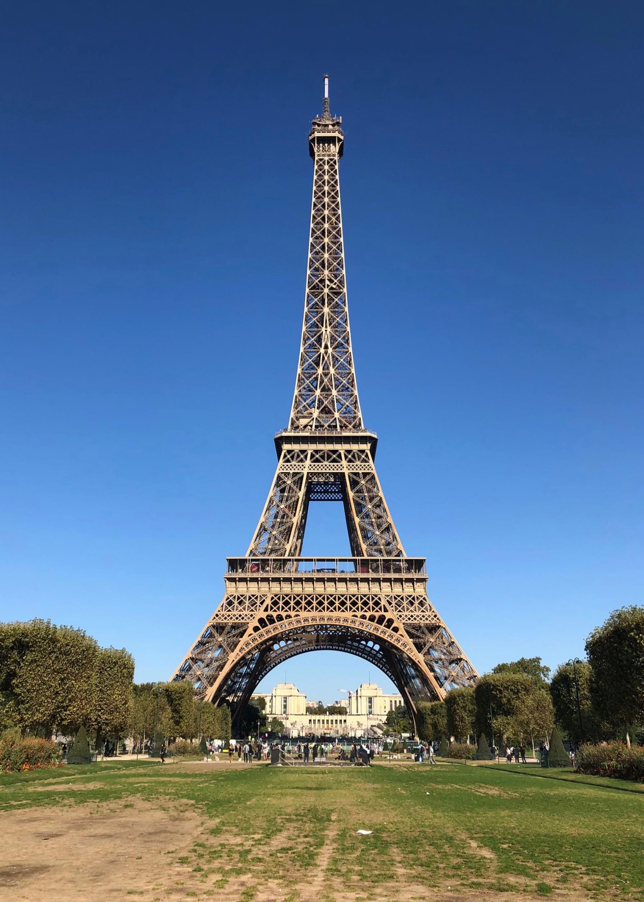
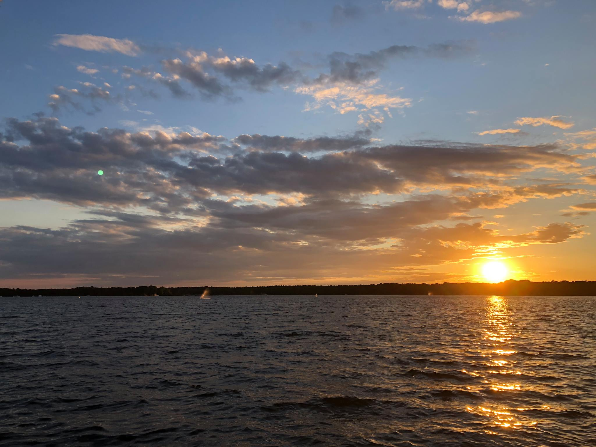

Last year, I wrote [a post](https://emilygorcenski.com/post/2018-setting-intentions/) to try to hold myself accountable for self-improvement goals in 2018. I thought 2018 might be a better year, and in a lot of ways it was, but I was perhaps not prepared for how hard it would be. I did a lot of great things this year, and I missed some goals, too. So, to prepare for next year, let's have a look back at what 2018 held for me, and then in a later post I'll look ahead for what goals I want to set for myself.

<!--more-->

## 2018 Brags

Hey, I've got a lot of brags here in the 2018, so let's go through some of them! In no particular order...

- I launched [First Vigil](https://first-vigil.com), a resource for tracking white supremacist crime;
- I was named to Bitch Magazine's [Bitch 50](https://www.bitchmedia.org/article/2018-bitch-50);
- I co-wrote a book chapter in [Seeking SRE](https://www.oreilly.com/library/view/seeking-sre/9781491978856/) with my good friend Liz Fong-Jones;
- Liz and I also [keynoted SRECon EMEA](https://www.youtube.com/watch?v=8Dro0mreAxk);
- I published an opinion piece in [Refinery29](https://www.refinery29.com/en-us/2018/10/215302/pittsburgh-shooting-reason-white-supremacists-trump);
- I appeared in a documentary on PBS Frontline called [Documenting Hate: Charlottesville](https://www.pbs.org/wgbh/frontline/film/documenting-hate-charlottesville/);
- My assailant pleaded guilty and the nonsensical lawsuit was settled for a mutual release of claims;
- I started a new job as a Lead Consultant Data Scientist;
- I moved to Germany and got a Blue Card;
- I traveled to Asia for the first time when worked in Bangkok for a while for a work project;
- I saw new cities: Köln, Aachen, Düsseldorf, Amsterdam, Paris, กรุงเทพมหานคร (Bangkok);
- Most importantly, I made many friendships and shared many stories.

## 2018 Misses

There were a lot of things I wanted to do in 2018 but fell short. Let's take a look.

### Working on the house

Moving to Berlin did not facilitate progress on this goal in any way... These projects need to get done so this will carry forward.

### Working on coding and math

One thing I learned was not to set vague goals like this anymore. I did do a bit of coding for fun, but I didn't dive into math studies the way I wanted to. So for 2019 I'll be more clear.

### Study Language

I set a goal for myself here to be at least A1 in German by year's end. Honestly, I probably am, but my confidence is not there. It's been a source of frustration that I've been unable to dedicate study time to this, so I'm going to work on that in 2019. I did pick up some Thai this year, though!

### Read more

Big fail here. I did get through one book, _The Turmoil_, which is a prequel to the starting point of the Modern Library project I want to undertake.

## A year in review

All things considered, 2018 was a damn hard year. Healing in the months since the terror attack in Charlottesville was not easy. It is still not easy. 2018 felt a lot like picking up the pieces. But I still managed to do some amazing work amidst the trauma and the terror and the chaos, and if I can do that much good in 2018, it actually leaves me hope for 2019.

Next up, I'll be writing my 2019 plan.

