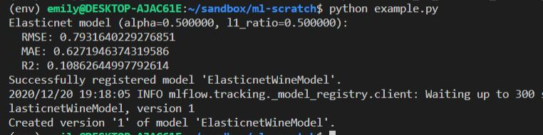
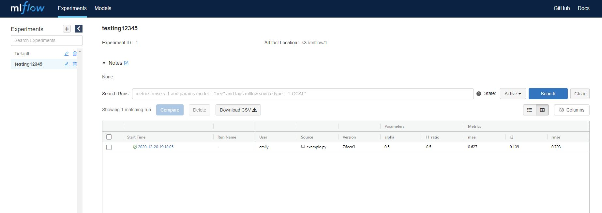
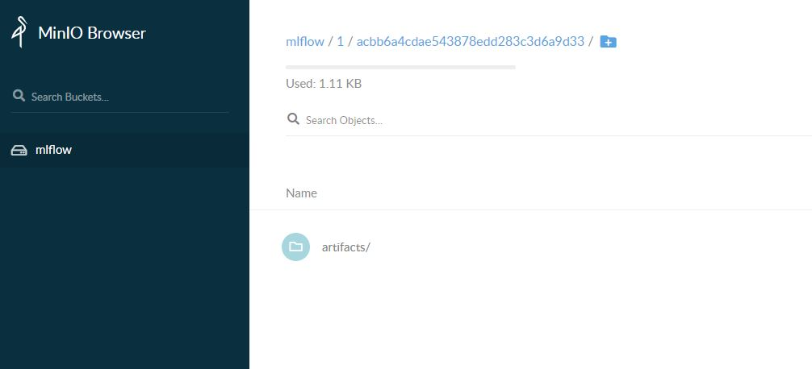
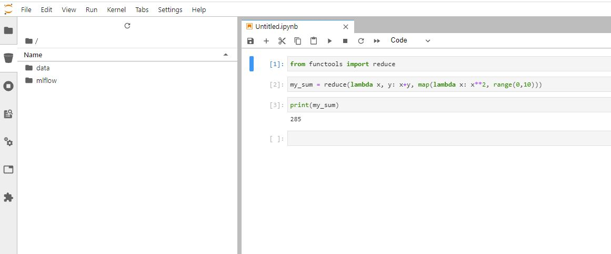

This post discusses creating a local data science workbench for local, production software-like development workflows.

<!--more-->

1. [tl;dr summary](#tldr-show-me-the-github)
1. [Background](#background)
1. [Dealing with Docker in Windows](#dealing-with-docker-in-windows)
1. [Configuring MLFlow](#configuring-mlflow)
1. [Configuring Postgres](#configuring-postgres)
1. [Configuring MinIO](#configuring-minio)
1. [Configuring Jupyterlab](#configuring-jupyterlab)
1. [References](#references)

# TL;DR Show me the Github

The code needed here can be found in [my Github repository](https://github.com/Gorcenski/ds-workbench). You'll need Docker installed to reproduce it. **Note: this is not suitable for production environments.**

# Background

One of the challenges with data science development is that the workflows require a lot more data, tooling, and experimentation that most software engineering workflows. Compounding this, many data scientists don't have the experience in production software development to effectively move their work to production. One way to improve this is to improve local development experiences for data science. This means configuring local tooling that looks like cloud-based workflows.

Too often, data scientists start by working in notebooks and never leave that ecosystem. This leads to some less-than-ideal patterns when it comes to production engineering. In this post, I'll explore putting together a local workbench that includes many of the tools that will help data scientists work effectively in local environments, and by building familiarity with these tools and ways of working, my hope is that data scientists will be able to explore greater ownership of production data science.

To start out, I thought a bit about what I want as a data scientist.

> **As a** data scientist,
> 
> **I want** to be able to explore data in many formats, experiment rapidly, visualize data, and organize assets locally,
> 
> **So that** I can more quickly move my work into production systems.

Starting here, I can configure a toolset. First, I'll want an experiment and asset tracking solution. I'll need a visualization and exploratory data analysis (EDA) environment. I work with data living in data lakes and in data warehouses, so I'll want a s3-like environment and a SQL-like environment. Last, I want some way to version my data.

With these requirements, I'll start with the following tools in my stack:

- [MLFlow](https://www.mlflow.org/) for experiment tracking and model asset management;
- PostgreSQL for a SQL engine and to serve as a backend for MLFlow;
- [MinIO](https://min.io/) to mimic AWS S3 and act as an artifact and data store;
- [Jupyterlab](https://jupyter.org/) as an EDA environment.

Most of my work is done on Macbooks, since that's what I use for work. But I'm doing this on my personal Windows machine, so I will have some additional challenges of making this all work within the Windows Subsystem for Linux.

At the end of the day, I want a nicely portable, easily configurable docker compose setup that gets all these tools up and running locally. I'm not concerned with making this production ready or runnable in the cloud. I basically want something that I can start with one command and will help me manage working with all kinds of data.

# Dealing with Docker in Windows

I run Windows 10 Professional, and I have Ubuntu 20.04 installed in WSL 2. I've installed Docker Desktop for Windows.

At first, I had some difficulty getting everything working. At first, I could stand up docker containers inside WSL, but not get to them in Windows. After struggling with the networking, I downgraded to WSL 1, and I was now able to access services on `localhost`, assuming I configured `--host 0.0.0.0` when executing `docker run`. However, I later encountered a weird issue: while I could access those services from in Windows, I could not access them in Ubuntu. I struggled with some configurations, including by doing `export DOCKER_HOST=tcp://127.0.0.1:2375` and checking "Expose daemon on tcp://localhost:2375 without TLS" in Docker Desktop. This did not work.

Ultimately, I went back to WSL 2, ensured that "Expose daemon on tcp://localhost:2375 without TLS" and "Use the WSL 2 based engine" were checked in Docker Desktop, and then did `unset DOCKER_HOST`. With this, I was able to make everything work in both Windows and Ubuntu. I can't say why this didn't work the first time around, but it works now.

# Configuring MLFlow

[MLFlow](https://www.mlflow.org/) is an experiment tracking framework that also includes some asset repository functionality. Since it is python-based, it's easy to install with `pip`. It's also easily containerized, so it's a good starting point. There are probably some MLFlow images available out there, but since it's easy to get running, we'll just build our own.

MLFlow can be run standalone, but it also allows us to use some backing technologies. We can store experiment runs using a SQL engine such as MySQL, PostgreSQL, sqlite, and so on. My go-to SQL database is Postgres, so I'll use that. In addition, MLFlow can talk to most filestores, such as S3, Google Cloud Storage, HDFS, Azure Blob Storage, and so on. I don't want my local environment talking to the cloud, but thankfully there are some tools that utilize these APIs. I'll use MinIO, and I'll discuss configuring this later. For now, all we need to know is that we'll need python support for Postgres and S3.

Starting in the root directory of our repository, we'll create a new folder, `mlflow`, and put a `Dockerfile` inside it with the following:

```Dockerfile
FROM python:3.7.9-slim

RUN pip install mlflow psycopg2-binary boto3
EXPOSE 5000
```

MLFlow by default uses port 5000. We also install the `psycopg2-binary` and `boto3` packages to enable Postgres and S3 support, respectively.

We can go ahead and build this using `docker build`, but let's actually start building our docker compose file.

```yaml
version: "3.3"

services:
  tracking_server:
    restart: always
    build: ./mlflow
    image: gorcenski/mlflow-scratch
    container_name: mlflow_server
    ports:
      - "5000:5000"
    volumes:
      - ./mlruns:/mlruns
    command: >
      mlflow server 
      --host 0.0.0.0
```

This is pretty basic. Run `docker-compose up` to build the image and create an MLFlow instance accessible at `http://localhost:5000`. We'll add more configuration later. For now, it's enough to have the service running.  

# Configuring Postgres

With the configuration just set up, we have MLFlow persisting data locally. But we can do better. Let's configure a backend SQL store. Since this is for local development, it also doesn't hurt to have access to a SQL engine, just in case we ever get into the position of wanting to do some SQL workbenching. We'll just use the default Postgres image available on Docker Hub.

We'll add the following snippet under `services` in our `docker-compose.yml` file, above the MLFlow section.

```yaml
db:
  restart: always
  image: postgres:11
  container_name: mlflow_db
  expose:
    - "${PG_PORT}"
  networks:
    - backend
  environment:
    - POSTGRES_USER=${PG_USER}
    - POSTGRES_PASSWORD=${PG_PASSWORD}
    - POSTGRES_DATABASE=${PG_DATABASE}
  volumes:
    - db_data:/var/lib/postgresql/data/
```

Now, let's create an environment file. In my repo, I call it `default.env` but it can be whatever you want. We'll use this to configure  Postgres:

```
# default.env

# MLFlow Configuration
MLFLOW_PORT=5000

# Postgres Configuration
PG_USER=mlflow
PG_PASSWORD=mlflow
PG_DATABASE=mlflow
PG_PORT=5432
```

Postgres's default port is 5432, and that suffices for our use cases. Moreover, notice how we've specified a volume in the docker compose file. We'll let Docker manage volumes for us rather than worrying about local filesystem management. As a top-level section in the yaml, add the following:

```yaml
volumes:
  db_data:
```

Finally, let's wire this up to MLFlow. We'll configure some networking and add some command arguments to the `mlflow` run command. The `docker-compose.yml` should now look like this:

```yaml
version: "3.3"

services:
  db:
    restart: always
    image: postgres:11
    container_name: mlflow_db
    expose:
      - "${PG_PORT}"
    networks:
      - backend
    environment:
      - POSTGRES_USER=${PG_USER}
      - POSTGRES_PASSWORD=${PG_PASSWORD}
      - POSTGRES_DATABASE=${PG_DATABASE}
    volumes:
      - db_data:/var/lib/postgresql/data/

  tracking_server:
    restart: always
    build: ./mlflow
    image: gorcenski/mlflow-scratch
    container_name: mlflow_server
    ports:
      - "${MLFLOW_PORT}:5000"
    networks:
      - frontend
      - backend
    command: >
      mlflow server 
      --backend-store-uri postgresql://${PG_USER}:${PG_PASSWORD}@db:${PG_PORT}/${PG_DATABASE}
      --host 0.0.0.0
      --default-artifact-root /data

volumes:
  db_data:
  minio_data:

networks:
  frontend:
    driver: bridge
  backend:
    driver: bridge
```

Note that when using `backend-store-uri`, one must also specify `--default-artifact-root`. Nevermind the value here, we'll change it in the next step.

To run this and import the environment variables, let's run `docker-compose --env-file default.env up -d` and navigate over to `localhost:5000`. Go ahead and create some experiments in the UI; this will help us be convinced that the data is actually persisting.

# Configuring MinIO

This is where it started getting tricky for me. [MinIO](https://min.io/) is a tool that offers an S3-like API for mocking cloud bucket storage. Figuring out the right options to make sure that it was talking to MLFlow was a little wonky, in part because of the way docker compose handles references. We don't need to build a MinIO image, so let's start by adding this to our `docker-compose.yml` file, under `services`:

```yaml
s3:
  image: minio/minio:RELEASE.2020-12-18T03-27-42Z
  volumes:
    - minio_data:/data
  ports:
    - "${MINIO_PORT}:9000"
  networks:
    - frontend
    - backend
  environment:
    - MINIO_ACCESS_KEY=${MINIO_ACCESS_KEY}
    - MINIO_SECRET_KEY=${MINIO_SECRET_ACCESS_KEY}
  command: server /data
  healthcheck:
    test: ["CMD", "curl", "-f", "http://localhost:9000/minio/health/live"]
    interval: 30s
    timeout: 20s
    retries: 3
```

MinIO's default port is 9000, and we'll add the following to our `default.env` file:

```
# minio configuration
MINIO_ACCESS_KEY=minio
MINIO_SECRET_ACCESS_KEY=minio123
MINIO_PORT=9000
MLFLOW_BUCKET_NAME=mlflow
```

Next, we'll change our MLFlow entry as follows:

```yaml
tracking_server:
  restart: always
  build: ./mlflow
  image: gorcenski/mlflow-scratch
  container_name: mlflow_server
  ports:
    - "${MLFLOW_PORT}:5000"
  networks:
    - frontend
    - backend
  environment:
    - AWS_ACCESS_KEY_ID=${MINIO_ACCESS_KEY}
    - AWS_SECRET_ACCESS_KEY=${MINIO_SECRET_ACCESS_KEY}
    - MLFLOW_S3_ENDPOINT_URL=http://s3:${MINIO_PORT}
  command: >
    mlflow server 
    --backend-store-uri postgresql://${PG_USER}:${PG_PASSWORD}@db:${PG_PORT}/${PG_DATABASE}
    --host 0.0.0.0
    --default-artifact-root s3://${MLFLOW_BUCKET_NAME}/
```

Notice that we're defining a bucket for MLFlow to use as an artifact store. However, this won't create the bucket. We can run docker-compose, but if we try to use MLFlow, it will crash. So let's automate creating the bucket. To do that, we'll need to use the MinIO client. We'll add this to our `services` in the docker compose file:

```yaml
create_buckets:
  image: minio/mc:RELEASE.2019-07-17T22-13-42Z
  depends_on:
    - s3
  networks:
    - backend
  entrypoint: >
    /bin/sh -c '
    sleep 5;
    /usr/bin/mc config host add s3 http://s3:${MINIO_PORT} ${MINIO_ACCESS_KEY} ${MINIO_SECRET_ACCESS_KEY} --api S3v4;
    [[ ! -z "`/usr/bin/mc ls s3 | grep challenge`" ]] || /usr/bin/mc mb s3/${MLFLOW_BUCKET_NAME};
    /usr/bin/mc policy download s3/${MLFLOW_BUCKET_NAME};
    exit 0;
    '
```

This should create a bucket for us to persist our models.

Our `docker-compose.yml` should now look like this:

```yaml
version: "3.3"

services:
  db:
    restart: always
    image: postgres:11
    container_name: mlflow_db
    expose:
      - "${PG_PORT}"
    networks:
      - backend
    environment:
      - POSTGRES_USER=${PG_USER}
      - POSTGRES_PASSWORD=${PG_PASSWORD}
      - POSTGRES_DATABASE=${PG_DATABASE}
    volumes:
      - db_data:/var/lib/postgresql/data/
  
  s3:
    image: minio/minio:RELEASE.2020-12-18T03-27-42Z
    volumes:
      - minio_data:/data
    ports:
      - "${MINIO_PORT}:9000"
    networks:
      - frontend
      - backend
    environment:
      - MINIO_ACCESS_KEY=${MINIO_ACCESS_KEY}
      - MINIO_SECRET_KEY=${MINIO_SECRET_ACCESS_KEY}
    command: server /data
    healthcheck:
      test: ["CMD", "curl", "-f", "http://localhost:9000/minio/health/live"]
      interval: 30s
      timeout: 20s
      retries: 3
  
  create_buckets:
    image: minio/mc:RELEASE.2019-07-17T22-13-42Z
    depends_on:
      - s3
    networks:
      - backend
    entrypoint: >
      /bin/sh -c '
      sleep 5;
      /usr/bin/mc config host add s3 http://s3:${MINIO_PORT} ${MINIO_ACCESS_KEY} ${MINIO_SECRET_ACCESS_KEY} --api S3v4;
      [[ ! -z "`/usr/bin/mc ls s3 | grep challenge`" ]] || /usr/bin/mc mb s3/${MLFLOW_BUCKET_NAME};
      /usr/bin/mc policy download s3/${MLFLOW_BUCKET_NAME};
      exit 0;
      '

  tracking_server:
    restart: always
    build: ./mlflow
    image: gorcenski/mlflow-scratch
    container_name: mlflow_server
    ports:
      - "${MLFLOW_PORT}:5000"
    networks:
      - frontend
      - backend
    environment:
      - AWS_ACCESS_KEY_ID=${MINIO_ACCESS_KEY}
      - AWS_SECRET_ACCESS_KEY=${MINIO_SECRET_ACCESS_KEY}
      - MLFLOW_S3_ENDPOINT_URL=http://s3:${MINIO_PORT}
    command: >
      mlflow server 
      --backend-store-uri postgresql://${PG_USER}:${PG_PASSWORD}@db:${PG_PORT}/${PG_DATABASE}
      --host 0.0.0.0
      --default-artifact-root s3://${MLFLOW_BUCKET_NAME}/

volumes:
  db_data:
  minio_data:

networks:
  frontend:
    driver: bridge
  backend:
    driver: bridge
```

and our `default.env` should now be:

```
# postgres configuration
PG_USER=mlflow
PG_PASSWORD=mlflow
PG_DATABASE=mlflow
PG_PORT=5432

# mlflow configuration
MLFLOW_PORT=5000

# minio configuration
MINIO_ACCESS_KEY=minio
MINIO_SECRET_ACCESS_KEY=minio123
MINIO_PORT=9000
MLFLOW_BUCKET_NAME=mlflow
```

Let's test this! I've copied [an example from MLFlow's website](https://www.mlflow.org/docs/latest/tutorials-and-examples/tutorial.html) and tweaked it to use our local services. You should be able to run this file as is, but don't forget to create a virtual environment using the method of your choice and install `pandas`, `sklearn`, and `mlflow`.

```python
# The data set used in this example is from http://archive.ics.uci.edu/ml/datasets/Wine+Quality
# P. Cortez, A. Cerdeira, F. Almeida, T. Matos and J. Reis.
# Modeling wine preferences by data mining from physicochemical properties. In Decision Support Systems, Elsevier, 47(4):547-553, 2009.

import os
import warnings
import sys

import pandas as pd
import numpy as np
from sklearn.metrics import mean_squared_error, mean_absolute_error, r2_score
from sklearn.model_selection import train_test_split
from sklearn.linear_model import ElasticNet
from urllib.parse import urlparse
import mlflow
import mlflow.sklearn

import logging

logging.basicConfig(level=logging.WARN)
logger = logging.getLogger(__name__)


def eval_metrics(actual, pred):
    rmse = np.sqrt(mean_squared_error(actual, pred))
    mae = mean_absolute_error(actual, pred)
    r2 = r2_score(actual, pred)
    return rmse, mae, r2


if __name__ == "__main__":
    warnings.filterwarnings("ignore")
    np.random.seed(40)

    # Read the wine-quality csv file from the URL
    csv_url = (
        "http://archive.ics.uci.edu/ml/machine-learning-databases/wine-quality/winequality-red.csv"
    )
    try:
        data = pd.read_csv(csv_url, sep=";")
    except Exception as e:
        logger.exception(
            "Unable to download training & test CSV, check your internet connection. Error: %s", e
        )

    # Split the data into training and test sets. (0.75, 0.25) split.
    train, test = train_test_split(data)

    # The predicted column is "quality" which is a scalar from [3, 9]
    train_x = train.drop(["quality"], axis=1)
    test_x = test.drop(["quality"], axis=1)
    train_y = train[["quality"]]
    test_y = test[["quality"]]

    alpha = float(sys.argv[1]) if len(sys.argv) > 1 else 0.5
    l1_ratio = float(sys.argv[2]) if len(sys.argv) > 2 else 0.5

    remote_server_uri = "http://localhost:5000" # set to your server URI
    mlflow.set_tracking_uri(remote_server_uri)
    mlflow.set_experiment("testing12345")

    with mlflow.start_run():
        lr = ElasticNet(alpha=alpha, l1_ratio=l1_ratio, random_state=42)
        lr.fit(train_x, train_y)

        predicted_qualities = lr.predict(test_x)

        (rmse, mae, r2) = eval_metrics(test_y, predicted_qualities)

        print("Elasticnet model (alpha=%f, l1_ratio=%f):" % (alpha, l1_ratio))
        print("  RMSE: %s" % rmse)
        print("  MAE: %s" % mae)
        print("  R2: %s" % r2)

        mlflow.log_param("alpha", alpha)
        mlflow.log_param("l1_ratio", l1_ratio)
        mlflow.log_metric("rmse", rmse)
        mlflow.log_metric("r2", r2)
        mlflow.log_metric("mae", mae)

        tracking_url_type_store = urlparse(mlflow.get_tracking_uri()).scheme

        # Model registry does not work with file store
        if tracking_url_type_store != "file":

            # Register the model
            # There are other ways to use the Model Registry, which depends on the use case,
            # please refer to the doc for more information:
            # https://mlflow.org/docs/latest/model-registry.html#api-workflow
            mlflow.sklearn.log_model(lr, "model", registered_model_name="ElasticnetWineModel")
        else:
            mlflow.sklearn.log_model(lr, "model")
```

Before we run this locally, we need to export a few of our environment variables exactly as they are defined in our `default.env` file:

```sh
export AWS_ACCESS_KEY_ID=minio
export AWS_SECRET_ACCESS_KEY=minio123
export MLFLOW_S3_ENDPOINT_URL=http://localhost:9000
```

Run a `docker-compose --env-file default.env up -d` followed by `python example.py` and you should see it register an experiment called `testing12345` and an artifact should now be persisted! We can go to `http://localhost:5000` and see it in the MLFlow UI, and also to `http://localhost:9000` to see it in the MinIO browser.





# Configuring Jupyterlab

[Jupyterlab](https://jupyter.org/) is an excellent exploratory environment that allows us to easily visualize data. However, it has its limitations and should not be used to develop production models, because notebook workflows are difficult to test, allow out-of-order execution, and are difficult to share and quality control. Nevertheless, notebooks have an important place in the data scientist toolkit, and Jupyterlab is a very useful utility.

To get this working with our stack, we'll use one of the standard images. I've chosen the `all-spark-notebook` image, since it gives me the capability to develop in Spark with python, Scala, or R and is generally the most complete image. But if you don't work in these technologies, you don't need this. However, I also want to accomplish a couple other things. I'd like to use MinIO as a data repository as well as a model repository. We don't have to get more complex than this; we can simply add a `data` bucket to MinIO. But I'd like to integrate some S3 browsing capabilities in my Jupyterlab install. Thankfully, there is [an extension](https://github.com/IBM/jupyterlab-s3-browser) for this, but I will need to do some configuration.

We'll start by creating a `juptyerlab` folder in our root folder and add a `Dockerfile` to it:

```Dockerfile
ARG BASE_CONTAINER=jupyter/all-spark-notebook
FROM $BASE_CONTAINER

USER root

RUN jupyter labextension install jupyterlab-s3-browser && \
    pip install jupyterlab-s3-browser && \
    jupyter serverextension enable --py jupyterlab_s3_browser && \
    jupyter lab build && \
    jupyter lab clean
```

This adds the `jupyterlab-s3-browser` to the notebook image. This will take a while to build, but we shouldn't need to do this often. You can also add other extensions in a similar manner, if you choose.

Next, let's add a data bucket in MinIO:

```yaml
create_buckets:
  image: minio/mc:RELEASE.2019-07-17T22-13-42Z
  depends_on:
    - s3
  networks:
    - backend
  entrypoint: >
    /bin/sh -c '
    sleep 5;
    /usr/bin/mc config host add s3 http://s3:${MINIO_PORT} ${MINIO_ACCESS_KEY} ${MINIO_SECRET_ACCESS_KEY} --api S3v4;
    [[ ! -z "`/usr/bin/mc ls s3 | grep challenge`" ]] || /usr/bin/mc mb s3/${MLFLOW_BUCKET_NAME};
    /usr/bin/mc policy download s3/${MLFLOW_BUCKET_NAME};
    [[ ! -z "`/usr/bin/mc ls s3 | grep challenge`" ]] || /usr/bin/mc mb s3/${DATA_REPO_BUCKET_NAME};
    /usr/bin/mc policy download s3/${DATA_REPO_BUCKET_NAME};
    exit 0;
    '
```

```
# default.env
...
# minio configuration
MINIO_ACCESS_KEY=minio
MINIO_SECRET_ACCESS_KEY=minio123
MINIO_PORT=9000
MLFLOW_BUCKET_NAME=mlflow
DATA_REPO_BUCKET_NAME=data
```

With this done, when we start our stack, we'll create a `data` bucket alongside the `mlflow` bucket. Next, let's configure Jupyterhub by adding this to `default.env

```
# jupyter configuration
JUPYTER_PORT=8888
NB_USER=gorcenski
JUPYTER_TOKEN=neely
```

The default Jupyterlab port is 8888, and I don't like the way that Jupyterlab uses the `joyvan` user by default, so I've changed it to my name. Also, when starting Jupyterlab, it generates a random token required to log into the service. Since this is a local workbench, we can just set the token here. In this example, I chose the last name of [my favorite hockey player of all time](https://www.youtube.com/watch?v=8252f0HJLL4).

Now, we can add the service to the `docker-compose.yml` file under `services`:

```yaml
jupyterlab:
  restart: always
  build: ./jupyterlab
  image: gorcenski/jupyterlab-allspark-workbench
  container_name: jupyterlab
  working_dir: /home/${NB_USER}
  user: root
  ports:
    - "${JUPYTER_PORT}:8888"
  volumes:
    - ./notebooks:/home/${NB_USER}
  networks:
    - frontend
    - backend
  environment:
    - NB_USER=${NB_USER}
    - CHOWN_HOME=yes
    - JUPYTER_ENABLE_LAB=yes
    - JUPYTERLAB_S3_ENDPOINT=http://s3:${MINIO_PORT}
    - JUPYTERLAB_S3_ACCESS_KEY_ID=${MINIO_ACCESS_KEY}
    - JUPYTERLAB_S3_SECRET_ACCESS_KEY=${MINIO_SECRET_ACCESS_KEY}
    - JUPYTER_TOKEN=${JUPYTER_TOKEN}
```

Here, we pay special attention to a couple of points. Notice that we need to add `JUPYTER_ENABLE_LAB=yes` to the environment variables, to run the lab environment. We set `user: root` to ensure we can install the right plugins, and `NB_USER=${NB_USER}`,  `CHOWN_HOME=yes` and `working_dir: /home/${NB_USER}` allow us to use our own username instead of the default `joyvan` user. I've also configured this to mount a local `notebooks` folder in our directory; however, we can configure this if we'd like. The motivation for doing this instead of using a Docker volume is because we might want to version control our notebooks, and that's easier when we have a local folder.

Our full `docker-compose.yml` should now be:

```yaml
version: "3.3"

services:
  db:
    restart: always
    image: postgres:11
    container_name: mlflow_db
    expose:
      - "${PG_PORT}"
    networks:
      - backend
    environment:
      - POSTGRES_USER=${PG_USER}
      - POSTGRES_PASSWORD=${PG_PASSWORD}
      - POSTGRES_DATABASE=${PG_DATABASE}
    volumes:
      - db_data:/var/lib/postgresql/data/
  
  s3:
    image: minio/minio:RELEASE.2020-12-18T03-27-42Z
    volumes:
      - minio_data:/data
    ports:
      - "${MINIO_PORT}:9000"
    networks:
      - frontend
      - backend
    environment:
      - MINIO_ACCESS_KEY=${MINIO_ACCESS_KEY}
      - MINIO_SECRET_KEY=${MINIO_SECRET_ACCESS_KEY}
    command: server /data
    healthcheck:
      test: ["CMD", "curl", "-f", "http://localhost:9000/minio/health/live"]
      interval: 30s
      timeout: 20s
      retries: 3
  
  create_buckets:
    image: minio/mc:RELEASE.2019-07-17T22-13-42Z
    depends_on:
      - s3
    networks:
      - backend
    entrypoint: >
      /bin/sh -c '
      sleep 5;
      /usr/bin/mc config host add s3 http://s3:${MINIO_PORT} ${MINIO_ACCESS_KEY} ${MINIO_SECRET_ACCESS_KEY} --api S3v4;
      [[ ! -z "`/usr/bin/mc ls s3 | grep challenge`" ]] || /usr/bin/mc mb s3/${MLFLOW_BUCKET_NAME};
      /usr/bin/mc policy download s3/${MLFLOW_BUCKET_NAME};
      [[ ! -z "`/usr/bin/mc ls s3 | grep challenge`" ]] || /usr/bin/mc mb s3/${DATA_REPO_BUCKET_NAME};
      /usr/bin/mc policy download s3/${DATA_REPO_BUCKET_NAME};
      exit 0;
      '

  tracking_server:
    restart: always
    build: ./mlflow
    image: gorcenski/mlflow-scratch
    container_name: mlflow_server
    ports:
      - "${MLFLOW_PORT}:5000"
    networks:
      - frontend
      - backend
    environment:
      - AWS_ACCESS_KEY_ID=${MINIO_ACCESS_KEY}
      - AWS_SECRET_ACCESS_KEY=${MINIO_SECRET_ACCESS_KEY}
      - MLFLOW_S3_ENDPOINT_URL=http://s3:${MINIO_PORT}
    command: >
      mlflow server 
      --backend-store-uri postgresql://${PG_USER}:${PG_PASSWORD}@db:${PG_PORT}/${PG_DATABASE}
      --host 0.0.0.0
      --default-artifact-root s3://mlflow/

  jupyterlab:
    restart: always
    build: ./jupyterlab
    image: gorcenski/jupyterlab-allspark-workbench
    container_name: jupyterlab
    working_dir: /home/${NB_USER}
    user: root
    ports:
      - "${JUPYTER_PORT}:8888"
    volumes:
      - ./notebooks:/home/${NB_USER}
    networks:
      - frontend
      - backend
    environment:
      - NB_USER=${NB_USER}
      - CHOWN_HOME=yes
      - JUPYTER_ENABLE_LAB=yes
      - JUPYTERLAB_S3_ENDPOINT=http://s3:${MINIO_PORT}
      - JUPYTERLAB_S3_ACCESS_KEY_ID=${MINIO_ACCESS_KEY}
      - JUPYTERLAB_S3_SECRET_ACCESS_KEY=${MINIO_SECRET_ACCESS_KEY}
      - JUPYTER_TOKEN=${JUPYTER_TOKEN}

volumes:
  db_data:
  minio_data:

networks:
  frontend:
    driver: bridge
  backend:
    driver: bridge
```

and our `default.env` should look like

```
# postgres configuration
PG_USER=mlflow
PG_PASSWORD=mlflow
PG_DATABASE=mlflow
PG_PORT=5432

# mlflow configuration
MLFLOW_PORT=5000

# minio configuration
MINIO_ACCESS_KEY=minio
MINIO_SECRET_ACCESS_KEY=minio123
MINIO_PORT=9000
MLFLOW_BUCKET_NAME=mlflow
DATA_REPO_BUCKET_NAME=data

# jupyter configuration
JUPYTER_PORT=8888
NB_USER=gorcenski
JUPYTER_TOKEN=neely
```

Fire this up with `docker-compose --env-file default.env up -d` and navigate to `http://localhost:8888/?token=neely` and it should load the Jupyterlab for you.



# References

Throughout this exercise, I relied heavily on work done by others. There are some excellent resources I built on, and I hope I reference them all herein.

- [haxoza/docker-compose.yml](https://gist.github.com/haxoza/22afe7cc4a9da7e8bdc09aad393a99cc): A gist that helped me auto-create the MinIO buckets;
- [Deploy MLFlow with docker compose](https://towardsdatascience.com/deploy-mlflow-with-docker-compose-8059f16b6039): I leaned heavily on this post;
- [Running S3 Object Storage Locally with MinIO](https://medium.com/the-innovation/running-s3-object-storage-locally-with-minio-f50540ffc239): This post helped me understand how to set up this handy tool;
- [Preparing to use Docker and Docker Compose from Windows 10 WSL](https://eloysalamanca.es/docker/preparing-to-use-docker-and-docker-compose-from-windows-10-wsl/): This post helped me sort my Docker on WSL issues out;
- [Introduction to MLflow for MLOps Part 3: Database Tracking, Minio Artifact Storage, and Registry](https://blog.noodle.ai/introduction-to-mlflow-for-mlops-part-3-database-tracking-minio-artifact-storage-and-registry/): This post described things similar to what I wanted to do