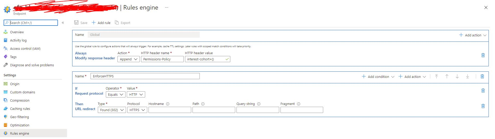
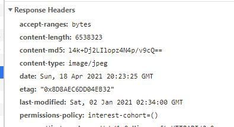

Here's how to disable Google's Federated Learning of Cohorts (FLoC) in an Azure-hosted static site.

<!--more-->

Google's Federated Learning of Cohorts (FLoC) adds browser-based tracking without third-party code coming across the wire. Previously, users could block third-party trackers, or at least be able to inspect a site to see how many trackers are being used. (For instance, on my site, I use _no_ trackers at all, not even basic web analytics). This technology is [viewed by some](https://www.eff.org/deeplinks/2021/03/googles-floc-terrible-idea) as a big privacy concern. However, it's possible to disable it by injecting an HTTP header in the response.

Disabling FLoC requires the site administrator to insert a custom response header. (To read more, see [here](https://plausible.io/blog/google-floc).) As long as you control the host, you can insert the response header. For static sites, we have to control this at the infrastructure level.

In [a previous post](../migrating-a-static-site-to-azure-with-terraform/), I showed how to use Terraform to set up everything you need to get a TLS-enabled static site hosted on Azure. With that heavy-lifting done, it's rather straightforward to add our header to disable FLoC.

Since I used Terraform to set up infrastructure as code for my blog, here's how to do it with terraform. In my `main.tf` file, I had a section where I specified an `azurerm_cdn_endpoint` resource:

```yaml
resource "azurerm_cdn_endpoint" "cdn_blog" {
  name                = "my-blog-cdn"
  profile_name        = azurerm_cdn_profile.cdn.name
  location            = azurerm_cdn_profile.cdn.location
  resource_group_name = azurerm_resource_group.rg.name
  origin_host_header  = azurerm_storage_account.blog_storage.primary_web_host
  ...
}
```

I had previously added a `delivery_rule` in this block to achieve HTTP-to-HTTPS redirects:

```yaml
resource "azurerm_cdn_endpoint" "cdn_blog" {
  ...

  delivery_rule {
    name  = "EnforceHTTPS"
    order = "1"

    request_scheme_condition {
      operator     = "Equal"
      match_values = ["HTTP"]
    }

    url_redirect_action {
      redirect_type = "Found"
      protocol      = "Https"
    }
  }
}
```

We could add a second delivery rule to this, with `order = "2"`. However, `delivery_rule` requires a condition, like the `request_scheme_condition` block above. We can simplify this by adding our header as a `global_delivery_rule` instead by adding the following block to our `azurerm_cdn_endpoint` resource, below the `delivery_rule` block:

```yaml

  global_delivery_rule {
    modify_response_header_action {
      action = "Append"
      name = "Permissions-Policy"
      value = "interest-cohort=()"
    }
  }
```

Thus, our resource block should read like:

```yaml
resource "azurerm_cdn_endpoint" "cdn_blog" {
  name                = "my-blog-cdn"
  profile_name        = azurerm_cdn_profile.cdn.name
  location            = azurerm_cdn_profile.cdn.location
  resource_group_name = azurerm_resource_group.rg.name
  origin_host_header  = azurerm_storage_account.blog_storage.primary_web_host

  origin {
    name      = "emilygorcenski-blog"
    host_name = azurerm_storage_account.blog_storage.primary_web_host
  }

  tags = {
    environment = "production"
    purpose     = "blog"
  }

  delivery_rule {
    name  = "EnforceHTTPS"
    order = "1"

    request_scheme_condition {
      operator     = "Equal"
      match_values = ["HTTP"]
    }

    url_redirect_action {
      redirect_type = "Found"
      protocol      = "Https"
    }
  }

  global_delivery_rule {
    modify_response_header_action {
      action = "Append"
      name = "Permissions-Policy"
      value = "interest-cohort=()"
    }
  }
}
```

If you want to use the Azure Portal instead, this is quite easy. Simply log in to your subscription, find your CDN, and click "Rules Engine." Then, you can add a Global Rule to "Always Modify Response Header." We'll want to add this to the Rules Engine for our CDN endpoint. As an action, we'll choose "Append," and for our HTTP header name enter `Permissions-Policy` with `interest-cohort=()` as a value.



Once this is done, we can head over to our site. Give it a minute to refresh, and then load a new page and inspect the headers in your favorite dev tool. You should see our header inserted into the response.



That's it! With a simple change, you can help improve the privacy of all your readers/users with very little added effort. As always, I encourage you to build sites that focus on user-privacy first and foremost. Please bug me [on Twitter](https://twitter.com/EmilyGorcenski) if you have any questions!

**Update: If you don't have the ability to control your site's HTTP headers, [this blog post](https://adalytics.io/blog/opt-out-floc-script) describes a way to do this in JavaScript that may work. Moreover, [WordPress has announced](https://make.wordpress.org/core/2021/04/18/proposal-treat-floc-as-a-security-concern/) that they will treat FLoC as a security concern and disable it for all of their sites.**