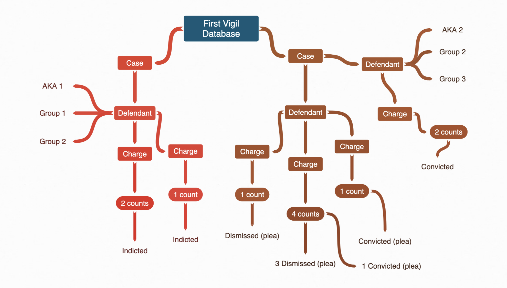

For a little more than six months, I've been running [First Vigil](https://first-vigil.com) entirely as a static site hosted directly on Google Cloud storage, and I'm getting close to the limits of the technical approach. This post will explore static site hosting and look at the challenges I have from a data to a infrastructure perspective.

<!--more-->

## The First Vigil Tech Stack

Before getting into some of the challenges and limitations, let's talk about the tech stack that First Vigil is currently running. When I build First Vigil, I wanted to create something that could go live rapidly. There were a number of important cases I was tracking, and I wanted a fast path to production. I also had a number of other requirements:

- tool-independent, human-readable, hand-editable data;
- low-cost hosting;
- low maintenance hosting;
- easy path to production.

The first point is, in my opinion, my primary driver. I wanted to avoid a few challenges here. Namely, I wanted a format that non-tech experts could navigate. So it needed to be something fairly straightforward, with minimal syntactical quirks. I also didn't want to maintain a CMS, and I wanted to be able to use Github's built-in pull request system to validate contributors' additions and edits to the data. Furthermore, I also wanted the data to be tool-independent. Criminal cases can last years, if not longer. I wanted the data to be as readable and accessible at the end of the sentences of these far-right actors. This meant using a plain-text format as the source of truth, rather than a storage solution like a relational database.

All of this saved me some engineering effort when getting the site off the ground. The solution, therefore, was to use YAML files to represent each case (more on why First Vigil is case-focused later.) The YAML is also convenient because it can be fairly easily transformed into frontmatter for static site generators. I wanted to use a static site because I could minimize hosting costs. First Vigil is run at a loss; minimizing hosting costs is necessary to keep the site sustainable.

Both [First Vigil](https://first-vigil.com) and [HowHateSleeps](https://howhatesleeps.com) are static sites built using the wonderful [Hugo](https://gohugo.io/) static site generator (as is this blog). Both sites are statically hosted on Google Cloud Storage, each in their own buckets. Media files are hosted in a third bucket, which serves as a data lake for all the projects in the First Vigil initiative.

There are but a few steps from the raw YAML data to production. This path has been designed to be as short as possible. But to describe it, we have to understand a little bit about how Hugo manages assets.

### First Vigil's Data Taxonomy

Court records are difficult. One must consider multiple possible many-to-many relationships. For any given incident, such as an assault, there may be one or more criminally-accused individuals, or defendants. Each defendant may catch one or more charges. Those charges can be spread out over one or more cases, in one or more jurisdictions. Furthermore, each defendant may belong to zero or more organizations. To complicate matters, each case may inherit one or more case identifiers (e.g. a federal case often gets assigned a magistrate judge case number at first until the defendants are indicted, and then it is assigned a criminal case identifier). And each charge may have one or more counts, and those counts can resolve differently.

It may be tempting to treat this in full [Boyce-Codd normal form](https://en.wikipedia.org/wiki/Boyce%E2%80%93Codd_normal_form). However, doing so would violate the hand-editable requirement I set out at the beginning of the project. There are other problems; even when charges are filed with the same Code number, they can have slightly different charge descriptions depending on the jurisdiction. It was a bit easier to denormalize the data by picking a unit and building the relationships as a tree structure.



Therefore, the choice was made to track _cases_ as the primary data unit. Each case has one or more defendants, who each have one or more charges, each with one or more counts. Each defendant can have zero or more aliases and belong to zero or more groups. Each case has a single YAML file. These may not be small; some federal cases have 40+ defendants, each of whom are catching multiple charges.

### First Vigil's Asset Pipeline

Of relevance here are two patterns used by Hugo. The first is the `static/` folder, which contains static assets like JS and CSS files, images, and the like. The second is the `data/` folder. Both of these folders provide asset material to the Hugo build pipeline. In particular, we want to use the `data/` folder to hold the case data for the _pages_ in the First Vigil site.

Because Hugo is a static site generator, it looks at pages and posts and uses those to build static HTML. While processing each page, Hugo has access to the page's/post's frontmatter, to a site configuration and parameters, and to the data assets. But because this is page-based, and because First Vigil displays many cases per page, we need to extract data from the case YAML files and stage them in the data folder in a meaningful way. This is essentially a set of extraction and transformation pre-processing steps.

The pages used fixed templates, and it is possible to create new clusters of cases with a unified theme, e.g. [The Antagonizers](https://first-vigil.com/pages/details/antagonizers/), by specifying defendants, groups, or individual case numbers. This is done by creating a new markdown file, for which the python preprocessor can generate site YAML.

These steps are executed with some basic python scripts that walk the source data folder, generate lists, sort and clean the data, and output them into Hugo-ready formats. This is a bit _ad hoc_ currently, and much more work is needed to clean up this process. Ideally, we'd skip the data transformation step entirely, and do all that work using Hugo's templating system, but more on that later. Before we execute the pre-processing, however, there is a YAML schema validation step which executes to make sure that the freeform fields meet the expected range of values.

In short, the process looks something like this:

```source-YAML -> YAML validation -> python preprocessing -> site-YAML -> Hugo generation -> deploy```

### Continuous Integration

First Vigil uses CircleCI for continuous integration and continuous delivery. Each commit to trunk goes to production. If a case YAML is edited, then those updates are reflected as soon as they are pushed to trunk or merged in via PR.

To accomplish this, I've built a Docker image based on a minimal Alpine Linux distribution. The image includes Python, Hugo, and the gcloud command line utilities. I've configured CircleCI to use this as the build image, and I set up jobs to run the YAML validation, build the Hugo site, and upload those to the hosting bucket on Google Cloud. This job runs on commit triggers, as well as nightly. The nightly build is necessary to update the otherwise static "upcoming" cases page.

One challenge with static site generation is how to test. I have very few tests because I have next to no code; the only testable code, really, is the python preprocessing. But one area where testing does prove super-valuable is in YAML validation. I want to enforce some schema on the YAML data, because the preprocessing is expecting certain fields and values. I also want to enforce enumerable values, e.g. in the Disposition field, so that it's easier to search and understand the data.

To do that, I use a YAML schema to validate against which is, unfortunately, somewhat verbose, and not entirely backwards compatible. A potential future solution might be to use something like [Protocol Buffers](https://developers.google.com/protocol-buffers/) which give me more control and more compatibility with less verbosity.

## Hosting a Static Site

With respect to minimizing hosting costs, it's expensive to run a compute instance 24/7, but it's cheap to run a cloud storage bucket configured as a static site host. Google Cloud Storage makes it very easy to accomplish this.

First, I set up a bucket with the name first-vigil.com. Google Cloud protects bucket names that can resolve to URLs; one must validate the domain by demonstrating ownership by copying a special key into a DNS TXT record. Once that's done, you can set access privileges to the bucket, either on a per object or per bucket level. By giving `allUsers` permission for `Storage Legacy Bucket Reader`, the open internet can see the item without being able to list directory contents.

However, this presents a problem: static hosting with Google Cloud Storage by default does not use TLS, and has no capabilities for managing a certificate. Even though First Vigil retains no users, session, or IP information anywhere, using [HTTPS is still important](https://developers.google.com/web/fundamentals/security/encrypt-in-transit/why-https). It is in my interest to protect users' communications, even if I'm not using cookies, logins, or any other form of tracking.

### Security by Design

If I want to design for security, I need to enable a more robust solution. But I still didn't want to incur the overhead of dealing with maintaining and paying for even a small compute instance. Thankfully, Google Cloud's Load Balancer solves my worries, almost.

To set this up, I create a Load Balancer instance. The Load Balancer consists of three components: a front-end, which is visible to the internet, a back-end, which is visible only inside Google Cloud, and host and routing rules. I can further configure the Load Balancer to be auto-scaling without the headache of managing a Kubernetes cluster myself.

The Load Balancer backends allow you to specify either a backend bucket or service. I set up three backend buckets: one for First Vigil, one for HowHateSleeps, and one for the combined data lake. For backend buckets, there's no need to specify a healthcheck or anything else; they're just there. Next, I set up a static IP for each site. I'll use these in the front-ends to ensure I can handle both HTTP and HTTPS traffic.

On the frontend, I set up four front-ends: two each for First Vigil and HowHateSleeps. Note that the data lake doens't get a front-end. More on that in a second. Each site has an HTTPS and an HTTP front end, each of which point to the static IP set up earlier. The HTTPS frontend also handles the SSL certificates, which I let Google manage. I configure certificates for the sites with no subdomain (e.g. `first-vigil.com`) and for the static data lake subdomain (`static.first-vigil.com`).

Finally, I configure routing rules. I set up routing filters so that `static.*` goes to the data lake backend, whereas all other traffic goes to the appropriate Cloud Storage backend. With this set, I can change my DNS routing to point to my static IP and I'm up and running. Both HTTP and HTTPS traffic should work.

### Downside of this Approach

There is one big downside: by enabling HTTP traffic, I'm not helping add to the overall security of the internet. In an ideal world, I would instead configure an HTTP-to-HTTPS redirect. This is not so hard with Load Balancer, one can find [a good tutorial](https://blog.realkinetic.com/http-to-https-using-google-cloud-load-balancer-dda57ac97c?gi=e6afba84b4bd) online.

However, this approach—redirecting with an nginx instance in Load Balancer—simply does not work when using backend buckets. There is no way that I could find to selectively route using the forwarding rules. I would need to configure this within a running backend service. This is because the forwarding rules are URL based and cannot see the scheme.

Furthermore, not enabling HTTP is a poor option. Sometimes, social media sites choose to link to the `http://` domain if you don't specify `https` explicitly. This leads to 404 errors because the load balancer has no path for those requests.

## First Vigil's Future

Clearly, First Vigil is stretching the capabilities of bucket-hosted static site generation. I am rapidly needing to manage the data in a better way; with 300+ cases and counting, it may be time for a database solution.

First Vigil also lacks some filtering and searching functionality that I'd really like to include. The entire site structure is due for an overhaul: better mobile-friendly displays, better aggregation of cases, and better unstructured data document management are all necessary.

This may mean that I need to get more creative in how I host First Vigil, or it may simply mean that I need a better tooling system for generating the static pages. I maintain that it is nonsensical to dynamically generate content that doens't change more than a handful of times per day, and static sites keep compute time to a minimum and can even allow CDNs to do a lot of the heavy lifting.