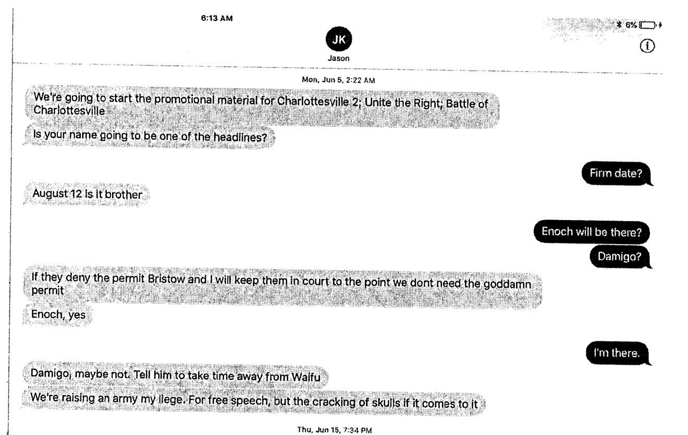

Jason Kessler once again tried to make August 12 all about him, this time by re-filing his comical joke of a lawsuit against the City of Charlottesville. Because he has not yet wasted enough of Charlottesville's taxpayers' dollars in his quest to not be the world's saddest sadboy, we'll go through graf by graf of his magnum opus to expose how much of a liar, cheat, and fraud he really, in my opinion, is. Shall we? To start, you can [read his suit here](https://www.courtlistener.com/recap/gov.uscourts.vawd.116228/gov.uscourts.vawd.116228.1.0.pdf). This is a non-legal analysis and all content herein reflects merely my opinion and no one elses.

<!--more-->

I won't copy the text of his claims, for simplicity.

1. Maryland, huh? Also Jason forgot a period at the end of this sentence.

2. Oh look, Parrott is involved.

3. Congratulations on looking up what a Monell claim is, but as [this forum](https://www.avvo.com/legal-answers/what-is-a-monell-claim--2306447.html) suggests, "[c]ivil rights cases are not do-it-yourself projects."

4. True.

5. True.

6. True.

7. Also true. But this is the last time you'll be hearing about any of the defendants for quite a while in this ride.

8. Ah yes, the heckler's veto. Let's see how this plays out.

9. Fact check: Jason Kessler texted co-organizer Richard Spencer claiming he would "raise an army" for free speech but also the "cracking of skulls" and advertised it to Spencer as the "Battle of Charlottesville."

10. I wouldn't admit to wanting to follow Kessler but ok.

11. Also, "racist," "sexist," and "bigoted."

12. At least they're admitting they're racist.

13. "Alt-Right" was a self-selected term. "Alt-Left" was a term invented by the "Alt-Right" in an attempt to reframe the narrative that they're actually unlikeable bigoted assholes. Also, "[m]akes it it's" is incorrect usage of apostrophes. All this time crafting this lawsuit and we're really stumbling out of the gate on punctuation aren't we?

14. The Alt-Right has been linked to multiple acts of terrorism and scores of arrests for violent instigatory acts. Antifascists using violence is only ever in self-defense to protect vulnerable people from being murdered, which is the stated goal of the "Alt-Right" "political messaging" and which has been borne out many times over.

15. The Alt-Right is perhaps considered Nazis because of things such as:

  - chanting Nazi chants;
  - wearing swastikas;
  - throwing Nazi salutes;
  - [referring to themselves as "we Nazis."](http://archive.is/Vitq7)

16. The claim here is that the city, its management, and the police wanted Antifa to come and commit violence to stop Jason. Just remember this for the upcoming paragraphs. To help set the mnemonic, here's a nonsensical phrase to recall: purple mango.

17. State of emergency has nothing to do with political speech, but ok. Fact check: August 10-12, 2018 was a state of emergency, too. Weird, that.

18. I guess.

19. At least Kessler can establish venue, unlike some in the area.

20. Whatever.

21. Antifa isn't a group, it's an ideology. [Even the FBI thinks so.](https://reason.com/2019/07/24/ted-cruz-wants-antifa-investigated-by-the-fbi/) The defendants are not referenced here.

22. "Smashing the patriarchy" isn't a call to violence, considering that the patriarchy is a system and not a physical person or thing, but whatever. We're really gonna struggle with this "concrete/abstract" dichotomy throughout this. The remainder of the graf is a repeat of the same material from seven grafs ago. This is getting tedious. The defendants are not referenced here.

23. "Antifa has repeatedly put its violent rhetoric into practice"—I'm not sure what this is even supposed to mean? Rhetoric is speech, and it strikes me as very ill-conceived to be making an argument that "violent rhetoric" is somehow an indicator of violence, considering how Kessler himself engaged in violent rhetoric and is being sued into oblivion about it and is literally arguing the opposite there. The defendants are not referenced here.

24. This is an incident in Washington, D.C., not Charlottesville. The defendants are not referenced here. Also, nearly all of the people arrested in the J20 incident [had their charges dropped](https://theintercept.com/2018/07/13/j20-charges-dropped-prosecutorial-misconduct/). That detail is omitted.

25. The incident described in this graf took place over 3,000 miles away, in Berkeley. The only people proven to be at the Berkeley event who were also at Charlottesville were people who joined the "Alt-Right" side of things: the four members from RAM, (who were convicted on federal Conspiracy to Riot charges)[https://www.cbs19news.com/content/news/RAM-founder-sentenced-for-riot-charge-connected-to-Unite-the-Right-rally-512956061.html]. That detail is omitted. The defendants are not referenced here.

26. Likewise. That detail is omitted. The defendants are not referenced here. A more clever man would have merged this graf and the one above in some intelligent, coherent way. 

27. May 1 is May Day, it's literally the left's event. No "antifa" disrupted the July 8 KKK rally; it was slightly delayed but the Klan was given its full permitted window. The fact that July 8 was the KKK is omitted here. The defendants are not referenced.

28. "The people" referred to here are the Klan. None of them were assaulted. Also, remember purple mango? Here he claims a cop was thinking that he was going to have to shoot "antifa" (aka peaceful protesters). Huh. Seems like not a thing that people working together would be likely to end up doing.

29. This claim is completely false. The claim is that in [the Heaphy Report](https://www.policefoundation.org/wp-content/uploads/2017/12/Charlottesville-Critical-Incident-Review-2017.pdf), page 64, the police chief wasn't going to protect rally participants from Antifa. The footnote in the claim quotes, "I'm not going to get them (Alt-right persons) in and out again." Neither of these things are true. Here is what the report actually says:

> In anticipation of the August 12 rally, commanders suggested additional Mobile Field Forces and the removal of media from the barricaded area. Lieutenant Mooney recalled Chief Thomas stating, in reference to the August 12 event, that “I’m not going to get them in and out” of the event.

In other words, the quote was specifically about members of the media. It had nothing to do with "Alt-right members" and it had nothing to do with protecting people from "Antifa." It literally had to do with whether media would be allowed inside a barricaded area or not and the logistics of that.

30. Defendants were also aware of Plaintiff's violent history and tactics.

31. This same thing has already been said.

32. This is a reference to an event that took place in Portland, OR. There is no evidence presented any of the people involved in Portland had anything to do with Charlottesville.

33. Literally impossible to quantify what "fever pitch" is supposed to mean, but we need only look at threats from the "Alt-Right" here, such as the ones I warned Charlottesville City Council about. This graf does not reference the defendants.

34. The linked video shows an unrelated group of people in Phoenix, Arizona engaging in legal sporting in April 2017, several weeks before the Unite the Right rally permit application was filed. This detail is omitted here. This graf does not reference the defendants.

35. Virginia is an open carry state and Jason Kessler's co-organizers, such as CJ Ross, also openly posted calls to arms with explicitly violent language. This detail is omitted here. This graf does not reference the defendants.

36. This is a reference from a Chicago-based group referencing a boxing gym—a sport where people punch each other—posted weeks before the Unite the Right permit was filed. This detail is omitted here. This graf does not reference the defendants.

37. Another blatantly false paragraph. The graf claims that Philly Antifa "advised their supporters that offensive violence is 'completely legal.'" Here is what the linked page actually says:

> Liberal and Pacifist Anti-Racists are attacked for their completely legal and non-violent work regularly.

In other words, the only reference to "completely legal" is the reference that warns that liberal and pacifist activists who are engaged in non-violent, non-criminal acts are nevertheless themselves subject to violence. The website does not suggest that offensive violence is completely legal. A second misleading claim in this graph suggests that Philly Antifa called for Nazis to be "neutralized on the streets." This is what the link actually says:

> Many Anti-Fascists do not engage in direct confrontation with fascists for a variety of reasons or concerns. But all Antifa know that confrontation is an important element in defeating fascism. An important part of fascist ideology is centered around “controlling the streets,” meaning establishing a hegemony over the political sphere and subcultures, unfettered access to young people for recruits, and a stage to perform their elaborate street theater propaganda rallies. When Anti-Fascists are successful, it means the Nazis and fascists in their town are completely neutralized on the streets, forcing them to act in a totally clandestine way.

These details are omitted here. This graf does not reference the defendants.

38. This references a tweet that was posted weeks before the Unite the Right permit application was filed. Contrary to the claim in the graf, neither Plaintiff's name appears in the tweet, the tweet it quotes, or the article that the quoted tweet links to. These details are omitted here. This graf does not reference the defendants.

39. The reference tweet contains only legal oppositional speech, the same thing Plaintiffs are arguing they were discriminated against for. This graf does not reference the defendants.

40. This graf alleges conduct by several non-defendants and is unclear whether any of the participants had any involvement in the counter-protests. One is a comment on a public call to non-violent action by Refuse Fascism, a group spun off of the Revolutionary Communist Party, a group regularly criticized and derided by antifascist organizers. Another reference here is an Instagram picture posted on November 19, 2017, more than two months after the Unite the Right rally took place. Another is a twitter post reference a violent incident outside a campaign rally, from over a year before the permit application for Unite the Right was filed. The last was a post made over a month after Unite the Right in reference to political opposition to supporters of the president. Unless "Antifa" has invented time travel, only one of the posts referenced in this graf was made in the time between the announcement of Unite the Right and the rally itself, and that post was a public comment by someone who did not attend the rally, posted to a public page of a group that did not attend the rally. It is unclear how any of this pertains to evidence of a conspiracy on behalf of the defendants.

41. Antifa isn't a group and there are no headquarters anywhere.

42. This graf alleges intelligence about soda cans filled with concrete. The graf does not allege that any such devices were recovered at the scene of the rally or in its surroundings

43. We're on graf 43 and Defendant Lt. Crannis-Curl makes her first appearance.

44. The allegation that Chief Thomas gave a stand-down order is unfounded and has been conclusively testified _against_ many times.

45. The klan. This graf is about the KKK, to be clear. This graf undermines the entire lawsuit. It only seems to demonstrate that police were, in fact, willing and able to control a situation even when "antifa" got unpleasant. The KKK were attendees of Unite the Right. Plaintiffs proffer no explanation why the KKK was treated favorably on July 8 but unfavorably on August 12.

46. This indentation is a nightmare.

47. A repeat of the false claim that Thomas said he was not going to get the "Alt-Right" in and out. The statement was in fact about the media.

48. The quoted section of the report is actually from a section outlining arrest plans and contingencies for if unmanageable fights broke out and how to handle concerns for officers' safety.

49. This is a meritless and unprovable non-factual statement.

50. This is standard operating procedure for crowd management.

51. I'll stipulate that Chief Thomas was a terrible overall police chief.

52. Why is this a paragraph? Just put it with the previous one. It adds nothing.

53. This is just Elmer Woodard's personal white whale.

54. This was just an excuse to use slurs, as conduct of non-parties well after the events in question have little to do with the validity of the harms being alleged.

55. The first linked video shows an unidentifiable man using a stick to attempt to separate a white supremacist mob—who was later convicted of Conspiracy to Riot—from a victim they were mob-beating. None of these videos allege any conduct of the Defendants. The videos do show evidence that was used to convict several members of the "Alt-Right."

56. No conduct described in this graf involves Defendants nor clear evidence of instigatory violence.

57. This video in fact shows an incident where a man from the Alt-Right ran into a peaceful crowd from the street, tackling a much smaller person, and several people ultimately removed him safely and lawfully. No conduct described in this graf involves Defendants nor clear evidence of instigatory violence.

58. No conduct described in this graf involves Defendants nor clear evidence of instigatory violence. Nothing described in this graf alleges any conduct that is unlawful in any way.

59. Federal court documents disagree with this assessment and this has been used to convict violent actors in criminal cases. Also, "results of this in progress heckler's veto" literally doesn't make sense.

60. It is unclear what this graf has to do with the conduct alleged.

61. Defendants are named! It's a miracle!

62. This graf could just be reincorporated into its predecessor.

63. It's unclear what this claim means.

64. Second appearance by Defendant Crannis-Curl!

65. And one here. In another pointless paragraph.

66. Rambling.

67. More rambling.

68. More rambling.

69. More rambling.

70. More rambling.

71. It's incredibly unclear what this statement is doing here in graf 71.

72. Fact check: police arranged a transport and entry plan for all speakers. The speakers chose to unilaterally abandon that plan at the last moment.

73. This is about what Plaintiff Kessler perceived, but is not a fact.

74. Congratulations. You entered a park that 1000 other people also entered.

75. The permit application wasn't for later in the day.

76. Permits don't actually let you break the law. Weird, I know.

77. We're seventy-seven grafs in and we finally have some conduct pertaining to Plaintiff Parrott. Nobody believes this, but ok.

78. Plaintiff whines about an unlawful assembly being declared just a few paragraphs after explaining how he witnessed people attending his rally being violent.

79. Same.

80. The referenced post does not involve conduct by defendants and in fact is a message politically against the quoted message regarding the Alt-Right's desire to have killed more people.

81. This tweet is safety advice to avoid injuries.

82. Conduct described in this tweet is completely legal.

83. Graf does not actually allege unlawful conduct, but instead "boasting"—in other words, protected speech. Plaintiffs show no evidence that these boasts were materialized through actual conduct.

