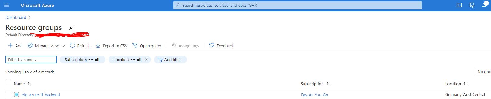
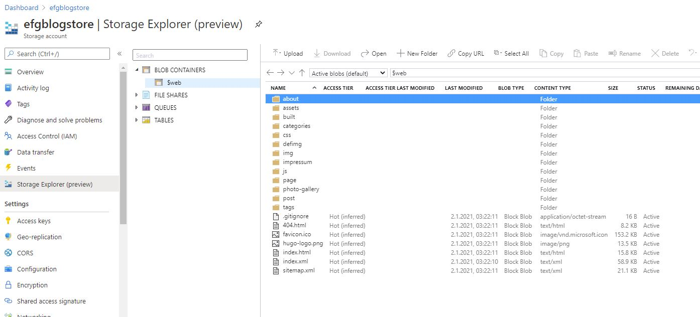
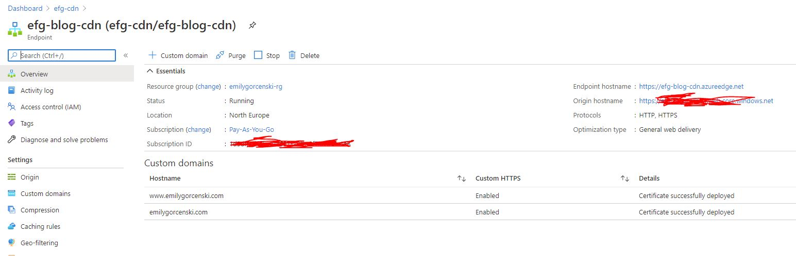
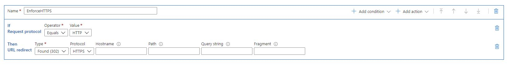
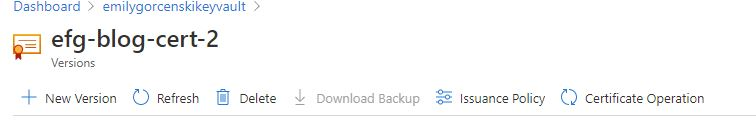

Here's how I migrated this blog from Firebase to Azure as a first step in setting up cloud-managed personal services.

<!--more-->

[tl;dr, I don't want to think I want to copy paste](#tldr-give-me-the-copy-pasta)

I wanted to migrate my blog off of Google's services for a few reasons. One, since I am seeing more use of Azure in data-related spaces, I wanted to build some familiarity with their offerings. Two, I wanted to learn Terraform. And three, I was really upset about how Google handled [the situation with Timnit Gebru](https://www.wired.com/story/timnit-gebru-exit-google-exposes-crisis-in-ai/).  

Firebase Hosting is a perfectly reasonable hosting solution for a static site, such as this one. In fact, I'd argue that it's among the easiest static site hosting solutions aside from Github Pages. So if you're looking for something simple, I'd really recommend just choosing one of those solutions, rather than messing around with cloud infrastructure. However, I wanted something a little more integrated. In addition to my blog, I run a number of other servies that I'd like to eventually move into Azure. So I decided to invest a day to learn the ins and outs of Azure and Terraform, and now I am pleased to put together this guide for how to do it yourself, if you're so inclined.

When possible, I am sticking with the concepts of Infrastructure as Code and Continuous Delivery. Many similar guides out there will walk you through using the Azure portal. Since I was learning as I was going, I did have to use the Portal frequently, but when possible tried migrating those actions back into Terraform. I believe everything should work as I present it here, but do note that it can be tiresome to tear things down and stand them back up again, so it's possible there might be some issues along the way. If you do find any, please email me (ejgorcenski@gmail.com)!

## Overview

My goal is to migrate an existing site with the following properties:

- host a static site at a custom domain (e.g. `emilygorcenski.com`);
- ensure that the site can be be served over `https`;
- force redirection from `http` to `https`;
- ensure that both the apex domain (`emilygorcenski.com`) and the `www` subdomain both work over `https`;
- automatically update the site on push to source control.

Almost all of these things are fairly easy to do, except for when it comes to implementing TLS. There are a few challenges here. The first challenge is handling both `http` and `https` traffic with a custom domain. The second challenge is enabling a certificant to work for the apex domain. If this was a new site, we could simplify this greatly by forcing everything to a `www` subdomain. However, since this is a migration, and since there are links to the blog not using the `www` subdomain, this becomes a little bit more complicated.

To make everything work, we're going to proceed with these steps:

1. [Set up tools and accounts](#step-1-set-up-tools-and-accounts);
1. [Set up an Azure Storage Account for a static site](#step-2-configuring-a-storage-account-to-host-a-static-site);
1. [Set up an Azure CDN to terminate TLS and handle `http` to `https` redirection](#step-3-set-up-an-azure-cdn);
1. [Set up an Azure DNS zone](#step-4-set-up-an-azure-dns-zone);
1. [Set up an Azure Key Vault and generate an x509 certificate](#step-5-set-up-azure-key-vault-and-generate-a-certificate);
1. [Sign the certificate and configure the CDN to use it](#step-6-sign-the-certificate-and-configure-the-cdn-to-use-it);
1. [Configure CI to deploy content](#step-7-continuously-deliver-with-github-actions).

Except for the certificate signing step, everything will be automated. Fortunately, certificate signing is a one-off process. At the end of this workflow, our site should be running, it should be auto building and deploying on commit, and TLS should be enabled for maximum security.

Let's begin!

## Step 1: Set up tools and accounts

I won't walk through all of this, but at a very minimum you'll need to set up the following accounts:

- Github account;
- Azure account;
- Azure subscription attached to aforementioned account;
- Account with a certificate signer.

I used [namecheap](https://www.namecheap.com) to sign my certificate. You could probably also use Let's Encrypt, but I didn't try that avenue. For the Azure subscription, if you're new to Azure you can set up a free trial account. Otherwise, you'll want to create a Pay-as-you-Go subscription.

In addition, you'll also need to install the following:

- git;
- Terraform;
- Azure CLI;
- The static site generator of your choosing (I use Hugo).

Once you've done all that, we'll do one more initial setup step by configuring a terraform backend storage on Azure. This will be in a separate Resource Group and this is a one-time config, so we'll just do this with the Azure CLI.

First, login to the Azure CLI using `az login`. Then, execute the following commands, replacing the values in `<BRACKETS>` with your chosen values:

```sh
az group create -g <BACKEND_STORE_RESOURCE_GROUP_NAME> -l <REGION>
az storage account create -n <BACKEND_STORE_STORAGE_ACCOUNT_NAME> -g <BACKEND_STORE_RESOURCE_GROUP_NAME> -l <REGION> --sku Standard_LRS
az storage container create -n terraform-state --account-name <BACKEND_STORE_STORAGE_ACCOUNT_NAME>
```

Check the Azure Portal to verify that the Resource Group has been properly created:


Next, in your static site directory, create a folder called `infrastructure` and add the following `variables.tf` file:

```t
# variables.tf
variable "domain" {
  type    = string
  default = "<YOUR_DOMAIN>"
}

variable "cdn_application_id" {
  default = "205478c0-bd83-4e1b-a9d6-db63a3e1e1c8" # This is azure's application UUID for a CDN endpoint
}

variable "regions" {
  type = map(string)
  default = {
    "primary" = "<REGION>"
    "cdn"     = "<CDN_REGION>"
  }
}
```

Because Azure CDNs don't map 1:1 to Azure regions, it may be necessary to choose a different CDN region than what you pick for your resource group, hence the two entries. Once this is done, we'll proceed to setting up the static site.

## Step 2: Configuring a Storage Account to host a static site

Once we have a Terraform backend configured, we'll start by using Terraform to configure a Resource Group and set up a Storage Account to serve as a static site host. Create a file in your `infrastructure` folder called `main.tf` and paste the following in it, replacing entries in `<BRACKETS>` as above.

```t
# Configure the Azure provider
terraform {
  required_providers {
    azurerm = {
      source  = "hashicorp/azurerm"
      version = ">= 2.26"
    }
  }

  backend "azurerm" {
    resource_group_name  = "<BACKEND_STORE_RESOURCE_GROUP_NAME>"
    storage_account_name = "<BACKEND_STORE_STORAGE_ACCOUNT_NAME>"
    container_name       = "terraform-state"
    key                  = "terraform.tfstate"
  }
}

provider "azurerm" {
  features {}
}

resource "azurerm_resource_group" "rg" {
  name     = "<RESOURCE_GROUP_NAME>"
  location = var.regions["primary"]
  tags = {
    Purpose = "Personal Cloud Space"
  }
}

resource "azurerm_storage_account" "blog_storage" {
  name                     = "<STATIC_SITE_STORAGE_ACCOUNT_NAME>"
  resource_group_name      = azurerm_resource_group.rg.name
  location                 = azurerm_resource_group.rg.location
  account_tier             = "Standard"
  account_replication_type = "LRS"
  account_kind             = "StorageV2"

  static_website {
    index_document     = "index.html"
    error_404_document = "404.html"
  }

  tags = {
    environment = "production"
    purpose     = "blog"
  }
}
```

You can choose different tags based on your use case, the values here don't matter too much. I use Azure tags to gain visibility into billing. This code is fairly straightforward: we're configuring our Terraform provider, setting up a remote backend using the Resources created in the previous step, and setting up a Storage Account.

> Note: Here we must use `account_kind = StorageV2` for static website functionality. 

Run the following commands to set up Terraform:

```sh
terraform init
terraform plan -out=storage_setup
```

You should see that the Terraform plan will create a Resource Group and a Storage Account. Go ahead and run `terraform apply "storage_setup"`. This will create the Resource Group for your account and create the Storage Account within it. Now, you should be able to easily test this. Go ahead an upload a simple `index.html` file using the Azure Portal. From your Dashboard, you should be able to see your blog storage. Click there, then click "Storage Explorer", expand "BLOB CONTAINERS", and then select "$web$. You can upload a file manually using the UI.



Now, in the left menu bar, scroll down a bit to where you see "Static Website." Click that, and you should be able to copy the Primary Endpoint. Paste that into a browser window and you should see your `index.html` file that you uploaded!

That's it for this step, let's move on.

## Step 2.5: Upload your static site to your storage account

At this point, you probably want to copy your static site into your storage account fully. This is easy enough to do with a manual command, assuming you have a local build of your website. In Hugo, the site is built into the `public` folder, so that's what I'll refer to here.

Run the following CLI command:

```sh
az storage blob upload-batch --account-name <STATIC_SITE_STORAGE_ACCOUNT_NAME> -d '$web' -s public/.
```

## Step 3: Set up an Azure CDN

The default endpoint URL is ugly and doesn't support `http` redirects. So let's remedy that. Unfortunately, there's no way of doing this without putting our storage account behind some more infrastructure. The best option is to use an Azure CDN. The Azure CDN offers us a lot of benefits: we can manage `http` to `https` redirects, use a custom domain, use our own x509 certificate, and guard against denial of service attacks that would otherwise ramp up our storage transfer costs. The downside is that a CDN will have to be flushed when we add new content, but we'll get to that later.

When I originally did this, I added the CDN incrementally. But this involved a lot of teardown and rebuild of infrastructure as I was learning what was what. So this will be a little complex, but we can manage.

First, add the following to your `main.tf`:

```t
resource "azurerm_cdn_profile" "cdn" {
  name                = "<CDN_PROFILE_NAME>"
  location            = var.regions["cdn"]
  resource_group_name = azurerm_resource_group.rg.name
  sku                 = "Standard_Microsoft"
}
```

It is necesssary to use `sku = "Standard_Microsoft"` here in order to enable the custom domains and redirect rules. Also, add the following:

```t
resource "azurerm_cdn_endpoint" "cdn_blog" {
  name                = "<CDN_ENDPOINT_NAME>"
  profile_name        = azurerm_cdn_profile.cdn.name
  location            = azurerm_cdn_profile.cdn.location
  resource_group_name = azurerm_resource_group.rg.name
  origin_host_header  = azurerm_storage_account.blog_storage.primary_web_host

  origin {
    name      = "<MEANINGFUL_ORIGIN_NAME>"
    host_name = azurerm_storage_account.blog_storage.primary_web_host
  }

  tags = {
    environment = "production"
    purpose     = "blog"
  }

  delivery_rule {
    name  = "EnforceHTTPS"
    order = "1"

    request_scheme_condition {
      operator     = "Equal"
      match_values = ["HTTP"]
    }

    url_redirect_action {
      redirect_type = "Found"
      protocol      = "Https"
    }
  }
}
```

This is a lot. What this will do is configure our CDN endpoint to point to our blog. This will create a new domain, `<CDN_ENDPOINT_NAME>.azureedge.net` that redirects to your static site. In order to make this redirect happen, it is critical to not leave out `origin_host_header  = azurerm_storage_account.blog_storage.primary_web_host`. Go ahead and click this to see if your site is there.

> Note: because this is a CDN, it might take 5-10 minutes for this to propagate. Go grab a tea.



The next slightly complex bit is the `delivery_rule`. This will create a rule that forces any `http` traffic to re-route to `https`. This is a great security practice that protects you and your users, and moreover makes your site backwards compatible if anyone has linked to an old `http://` address out there on the web. We won't be configuring our custom domains just yet.

Clicking on "Rules Engine" on the left should show you that you have successfully implemented the `EnforceHttps` rule.



After a few minutes, you should be able to see your site at `www.yourdomain.com`. With that done, we can move on to the hard steps. We have not yet set up the CDN to accept a custom apex domain, and your DNS is still being handled by your old provider. We'll address this in the next steps.

## Step 4: Set up an Azure DNS Zone

First, go to your DNS provider. **This step is very important**. We're going to add/update two `CNAME` records. First, add a `CNAME` record with the host `www` and a target of `<CDN_ENDPOINT_NAME>.azureedge.net`. If you already have a `www` entry, then you can edit the existing one. Next add another `CNAME` record with a host of `cdnverify` and a target of `cdnverify.<CDN_ENDPOINT_NAME>.azureedge.net`. Azure gives `cdnverify` special treatment, and this is how we'll allow ourselves to add a custom apex domain to the CDN.

Next, we'll create an Azure DNS zone. In principle, this step is not strictly necessary. But I believe it will make things a lot easier. Why? Because if you are hosting your DNS off of Azure, you will likely have problems with redirecting the apex domain to the CDN. You can't guarantee an IP address for the CDN for an `A` record. So let's set up a DNS zone in Azure instead. This has the benefit of allowing you to create an Alias Record Set. Add the following to your terraform:

```t
resource "azurerm_dns_zone" "<DNS_ZONE_NAME>" {
  name                = var.domain
  resource_group_name = azurerm_resource_group.rg.name
  tags = {
    purpose = "blog"
  }
}

resource "azurerm_dns_a_record" "<DNS_ALIAS_NAME>" {
  name                = "@"
  zone_name           = azurerm_dns_zone.<DNS_ZONE_NAME>.name
  resource_group_name = azurerm_resource_group.rg.name
  ttl                 = 300
  target_resource_id  = azurerm_cdn_endpoint.cdn_blog.id

  provisioner "local-exec" {
    command = <<EOT
  az cdn custom-domain create \
  --endpoint-name ${azurerm_cdn_endpoint.cdn_blog.name} \
  --hostname www.${var.domain} \
  --resource-group ${azurerm_resource_group.rg.name} \
  --profile-name ${azurerm_cdn_profile.cdn.name} \
  -n <MEANINGFUL_CUSTOM_DOMAIN_NAME>
  EOT
  }

  provisioner "local-exec" {
    command = <<EOT
  az cdn custom-domain create \
  --endpoint-name ${azurerm_cdn_endpoint.cdn_blog.name} \
  --hostname ${var.domain} \
  --resource-group ${azurerm_resource_group.rg.name} \
  --profile-name ${azurerm_cdn_profile.cdn.name} -n apex
  EOT
  }

  provisioner "local-exec" {
    command = <<EOT
  az cdn custom-domain enable-https \
  --endpoint-name ${azurerm_cdn_endpoint.cdn_blog.name} \
  --resource-group ${azurerm_resource_group.rg.name} \
  --profile-name ${azurerm_cdn_profile.cdn.name} \
  -n <MEANINGFUL_CUSTOM_DOMAIN_NAME>
  EOT
  }
}

resource "azurerm_dns_cname_record" "www_cname" {
  name                = "www"
  zone_name           = azurerm_dns_zone.<DNS_ZONE_NAME>.name
  resource_group_name = azurerm_resource_group.rg.name
  ttl                 = 3600
  target_resource_id  = azurerm_cdn_endpoint.cdn_blog.id
}
```

The first block will configure a DNS zone and also add an aliased record pointing to your CDN. This dramatically simplifies DNS management overall. The second block configures an aliased `A` record pointing to your CDN, something that we can't necessarily do with an external DNS provider. 

The `provisioner` commands are a bit more complex. As of this writing, there is no option in pure Terraform to create a custom domain to attach to the CDN endpoint. In order to make this work, we need to use a `provisioner` script that will run at the end of the creation of the resource. This is where things get tricky. In general, when you create a custom domain in a CDN endpoint, say `azure.yourdomain.com`, Azure will look for a matching `CNAME` record in your DNS with the host name `azure`. For the apex domain, `yourdomain.com`, Azure will look for a `cdnverify` record as described above.

If this command fails, but the resource is otherwise successfully created, the command will not run again on a subsequent `terraform apply`. Furthermore, the first command will fail if it cannot find a `CNAME` record pointing `www.yourdomain.com` to `<CDN_ENDPOINT_NAME>.azureedge.net`, and the second will fail if it cannot find a `CNAME` record with a host name of `cdnverify` pointing to `cdnverify.<CDN_ENDPOINT_NAME>.azureedge.net`. That is why it is necessary to enter these records in your existing DNS provider before undertaking this step.  At this point, you should be able to navigate to your Azure Dashboard, find the CDN you configured, and see that you've created two custom domains. 

Finally, the third `provisioner` will attach a CDN-managed certificate to your `www` subdomain. We will want to do this to avoid any security warnings that may result from us changing an existing `www` `CNAME` record. Unfortunately, Azure is no longer able to provide CDN-managed certificates for apex domains. Therefore, we'll need to do a little more work in order to properly migrate.

## Step 5: Set up Azure Key Vault and generate a certificate

If we were creating a new site, we might be happy just using `www.yourdomain.com` and being done with it. However, my existing site allowed the apex domain to work fine, which means if I don't fully integrate a certificate for the domain, existing links on the internet will be broken. Moreover, since this is a static site being hosted from a storage account, I don't want to manage Let's Encrypt certificates every three months manually. So I chose to go ahead and buy a certificate on Namecheap, but you can use whatever method you're most comfortable with.

In order to bring your own certificate to an Azure CDN, we need to set up a Key Vault. Since we're already going to do that, we may as well generate a certificate to have signed by a signing authority. Azure integrates with a couple of authorities, but you can also use an independent signer. It cost me less than $30 for five years of service.

> Note: Azure also allows you to generate self-signed certificates, but these do not work with the Azure CDN.

We'll implement our last bit of Terraform code now:

```t
data "azurerm_client_config" "current" {}

resource "azuread_service_principal" "sp" {
  application_id = var.cdn_application_id
}

resource "azurerm_key_vault" "kv" {
  name                       = "<MEANINGFUL_KEYVAULT_NAME>"
  location                   = azurerm_resource_group.rg.location
  resource_group_name        = azurerm_resource_group.rg.name
  tenant_id                  = data.azurerm_client_config.current.tenant_id
  sku_name                   = "standard"
  soft_delete_enabled        = true
  soft_delete_retention_days = 7

  access_policy {
    tenant_id = data.azurerm_client_config.current.tenant_id
    object_id = data.azurerm_client_config.current.object_id

    certificate_permissions = [
      "create",
      "delete",
      "deleteissuers",
      "get",
      "getissuers",
      "import",
      "list",
      "listissuers",
      "managecontacts",
      "manageissuers",
      "purge",
      "setissuers",
      "update",
    ]

    key_permissions = [
      "backup",
      "create",
      "decrypt",
      "delete",
      "encrypt",
      "get",
      "import",
      "list",
      "purge",
      "recover",
      "restore",
      "sign",
      "unwrapKey",
      "update",
      "verify",
      "wrapKey",
    ]

    secret_permissions = [
      "backup",
      "delete",
      "get",
      "list",
      "purge",
      "recover",
      "restore",
      "set",
    ]
  }
  access_policy {
    tenant_id = data.azurerm_client_config.current.tenant_id
    object_id = azuread_service_principal.sp.id

    certificate_permissions = [
      "get",
      "list",
    ]

    secret_permissions = [
      "get",
      "list",
    ]
  }
  tags = {
    purpose = "blog"
  }
}

resource "azurerm_key_vault_certificate" "cert" {
  name         = "<MEANINGFUL_CERTIFICATE_NAME>"
  key_vault_id = azurerm_key_vault.kv.id

  certificate_policy {
    issuer_parameters {
      name = "Unknown"
    }

    key_properties {
      exportable = true
      key_size   = 2048
      key_type   = "RSA"
      reuse_key  = true
    }

    lifetime_action {
      action {
        action_type = "EmailContacts"
      }

      trigger {
        days_before_expiry = 30
      }
    }

    secret_properties {
      content_type = "application/x-pkcs12"
    }

    x509_certificate_properties {
      # Server Authentication = 1.3.6.1.5.5.7.3.1
      # Client Authentication = 1.3.6.1.5.5.7.3.2
      extended_key_usage = ["1.3.6.1.5.5.7.3.1"]

      key_usage = [
        "cRLSign",
        "dataEncipherment",
        "digitalSignature",
        "keyAgreement",
        "keyCertSign",
        "keyEncipherment",
      ]

      subject_alternative_names {
        dns_names = ["www.${var.domain}"]
      }

      subject            = "CN=${var.domain}"
      validity_in_months = 12
    }
  }

  tags = {
    purpose = "blog"
  }
}
```

Don't fall into my traps. First, we must set `name = "Unknown"` in the `issuer_parameters` block to use an externally-signed certificate. Moreover, we must use `content_type = "application/x-pkcs12"`.

Running this with `terraform apply` will generate a Key Vault and a certificate. It should add two access policies to the Key Vault: one for your administrator account, which is necessary to generate certificates and secrets, and one for the CDN application, which only needs `get` and `list` permissions set on `certificates` and `secrets`.

## Step 6: Sign the Certificate and configure the CDN to use it

Once we have generated the certificate, we now need to do some manual steps.

Navigate to your Azure Key Vault, select Certificates, and click on your certificate. Next, select the "Certificate Operation" link.



From here click "Download CSR". Use this with your signing authority and configure your preferred authentication method. I chose DNS authentication and followed the instructions provided. However, you can also use HTTP authentication and upload a file to your web host, or any other means offered.

Once you receive a signed certificate (this took me less than 10 minutes once I figured it all out), you can then click "Merge Signed Request" to upload your signed certificate. This will automatically enable the certificate. We only have two steps left: telling the CDN to use these certificates, and then switching nameservers to Azure.

Navigate back to your CDN. You should see your custom domains. Click on either of them, and then enable "Custom domain HTTPS." Choose the option for "Use my own certificate" and then select the Key Vault, Certificate, and Certificate Version from the drop downs. Click save.

The last step is to switch DNS nameservers with our DNS provider. We'll want to do that now so that the CDN can properly provision the certificates.

Go back to your Azure Dashboard, and select your DNS Zone. On the Overview screen, you should see four nameservers in the top right. Confirm that you have an `A` record with the Name `@` configured to point to an Azure CDN resource. If so, then proceed to your DNS provider and switch nameservers to the Azure ones.

Once complete, you should be ready to go! The last step will be to configure your build tooling to update your static site.

## Step 7: Continuously Deliver with Github Actions

We'll want to be able to redeploy our content automatically. Ideally, we'd also deploy our infrastructure in our CI/CD environment. However, the Terraform scripting above uses some Azure Active Directory resources. In order to get these working in the CI/CD pipeline, there is a bit more work that needs to be done to adequately manage permissions. It's probably possible to do this, but I've timeboxed myself to two days of work for this learning, and I will not implement that here. For now, running Terraform locally is sufficient to stand up and destroy all the infrastructure we need.

To get started, we're going to use Github actions to build our site and deploy it. In order to do this, we'll need to do the following:

- compile the static site using our static site generator, in this case Hugo;
- upload compiled site to Azure;
- purge the CDN.

In order to do this, we first need to create a Service Principal to use in Azure: `az ad sp create-for-rbac --name "azure-actions-tf" --role Contributor --scopes /subscriptions/<SUBSCRIPTION_ID>/resourceGroups/<RESOURCE_GROUP_NAME> --sdk-auth`. This will output some JSON. **Do not add this to version control**. Instead, we'll navigate to our Github repo, click Settings, then Secrets, and add it as a new Repository Secret called `AZURE_CREDENTIALS`. 

Next, create a folder in your repository called `.github`. In it, create a subfolder called `workflows` and then create a text file, `deploy.yml`. In it, paste something similar to the following:

```yaml
on:
  push:
    branches: [ main ]

jobs:
  deploy:
    runs-on: ubuntu-latest
    steps:
      - uses: actions/checkout@v2
        with:
          submodules: true  # Fetch Hugo themes (true OR recursive)
          fetch-depth: 0    # Fetch all history for .GitInfo and .Lastmod

      - name: Setup Hugo
        uses: peaceiris/actions-hugo@v2
        with:
          hugo-version: '0.68.3'
          # extended: true

      - name: Build
        run: hugo

      - uses: azure/login@v1
        with:
          creds: ${{ secrets.AZURE_CREDENTIALS }}

      - name: Upload to blob storage
        uses: azure/CLI@v1
        with:
            azcliversion: 2.0.72
            inlineScript: |
                az storage blob upload-batch --account-name <STATIC_SITE_STORAGE_ACCOUNT_NAME> -d '$web' -s public/.

      - name: Purge CDN endpoint
        uses: azure/CLI@v1
        with:
            azcliversion: 2.0.72
            inlineScript: |
                az cdn endpoint purge --content-paths  "/*" --profile-name "<CDN_PROFILE_NAME>" --name "<CDN_ENDPOINT_NAME>" --resource-group "<RESOURCE_GROUP_NAME>"

      - name: logout
        run: |
            az logout
```

Here you'll want to replace the specifics of your static site generator. Save this and push this to your repo. If all goes well, you should be able to deploy new content on every commit to `main`!

## TL;DR Give me the copy-pasta

Everything in `<BRACKETS>` needs to be replaced with a string of your choosing.

Run to configure a remote backend:

```sh
az login
az group create -g <BACKEND_STORE_RESOURCE_GROUP_NAME> -l <REGION>
az storage account create -n <BACKEND_STORE_STORAGE_ACCOUNT_NAME> -g <BACKEND_STORE_RESOURCE_GROUP_NAME> -l <REGION> --sku Standard_LRS
az storage container create -n terraform-state --account-name <BACKEND_STORE_STORAGE_ACCOUNT_NAME>
```

Create DNS `CNAME` entries:
- `www` pointing to `<CDN_ENDPOINT_NAME>.azureedge.net` and
- `cdnverify` pointing to `cdnverify.<CDN_ENDPOINT_NAME>.azureedge.net`.

Create `variables.tf`:

```t
# variables.tf
variable "domain" {
  type    = string
  default = "<YOUR_DOMAIN>"
}

variable "cdn_application_id" {
  default = "205478c0-bd83-4e1b-a9d6-db63a3e1e1c8" # This is azure's application UUID for a CDN endpoint
}

variable "regions" {
  type = map(string)
  default = {
    "primary" = "<REGION>"
    "cdn"     = "<CDN_REGION>"
  }
}
```

Create main.tf:

```t
# main.tf
# Configure the Azure provider
terraform {
  required_providers {
    azurerm = {
      source  = "hashicorp/azurerm"
      version = ">= 2.26"
    }
  }

  backend "azurerm" {
    resource_group_name  = "<BACKEND_STORE_RESOURCE_GROUP_NAME>"
    storage_account_name = "<BACKEND_STORE_STORAGE_ACCOUNT_NAME>"
    container_name       = "terraform-state"
    key                  = "terraform.tfstate"
  }
}

provider "azurerm" {
  features {}
}

resource "azurerm_resource_group" "rg" {
  name     = "<RESOURCE_GROUP_NAME>"
  location = var.regions["primary"]
  tags = {
    Purpose = "Personal Cloud Space"
  }
}

resource "azurerm_storage_account" "blog_storage" {
  name                     = "<STATIC_SITE_STORAGE_ACCOUNT_NAME>"
  resource_group_name      = azurerm_resource_group.rg.name
  location                 = azurerm_resource_group.rg.location
  account_tier             = "Standard"
  account_replication_type = "LRS"
  account_kind             = "StorageV2"

  static_website {
    index_document     = "index.html"
    error_404_document = "404.html"
  }

  tags = {
    environment = "production"
    purpose     = "blog"
  }
}

resource "azurerm_cdn_profile" "cdn" {
  name                = "<CDN_PROFILE_NAME>"
  location            = var.regions["cdn"]
  resource_group_name = azurerm_resource_group.rg.name
  sku                 = "Standard_Microsoft"
}

resource "azurerm_cdn_endpoint" "cdn_blog" {
  name                = "<CDN_ENDPOINT_NAME>"
  profile_name        = azurerm_cdn_profile.cdn.name
  location            = azurerm_cdn_profile.cdn.location
  resource_group_name = azurerm_resource_group.rg.name
  origin_host_header  = azurerm_storage_account.blog_storage.primary_web_host

  origin {
    name      = "<MEANINGFUL_ORIGIN_NAME>"
    host_name = azurerm_storage_account.blog_storage.primary_web_host
  }

  tags = {
    environment = "production"
    purpose     = "blog"
  }

  delivery_rule {
    name  = "EnforceHTTPS"
    order = "1"

    request_scheme_condition {
      operator     = "Equal"
      match_values = ["HTTP"]
    }

    url_redirect_action {
      redirect_type = "Found"
      protocol      = "Https"
    }
  }
}

resource "azurerm_dns_zone" "<DNS_ZONE_NAME>" {
  name                = var.domain
  resource_group_name = azurerm_resource_group.rg.name
  tags = {
    purpose = "blog"
  }
}

resource "azurerm_dns_a_record" "<DNS_ALIAS_NAME>" {
  name                = "@"
  zone_name           = azurerm_dns_zone.<DNS_ZONE_NAME>.name
  resource_group_name = azurerm_resource_group.rg.name
  ttl                 = 300
  target_resource_id  = azurerm_cdn_endpoint.cdn_blog.id

  provisioner "local-exec" {
    command = <<EOT
  az cdn custom-domain create \
  --endpoint-name ${azurerm_cdn_endpoint.cdn_blog.name} \
  --hostname www.${var.domain} \
  --resource-group ${azurerm_resource_group.rg.name} \
  --profile-name ${azurerm_cdn_profile.cdn.name} \
  -n <MEANINGFUL_CUSTOM_DOMAIN_NAME>
  EOT
  }

  provisioner "local-exec" {
    command = <<EOT
  az cdn custom-domain create \
  --endpoint-name ${azurerm_cdn_endpoint.cdn_blog.name} \
  --hostname ${var.domain} \
  --resource-group ${azurerm_resource_group.rg.name} \
  --profile-name ${azurerm_cdn_profile.cdn.name} -n apex
  EOT
  }

  provisioner "local-exec" {
    command = <<EOT
  az cdn custom-domain enable-https \
  --endpoint-name ${azurerm_cdn_endpoint.cdn_blog.name} \
  --resource-group ${azurerm_resource_group.rg.name} \
  --profile-name ${azurerm_cdn_profile.cdn.name} \
  -n emilygorcenski
  EOT
  }
}

resource "azurerm_dns_cname_record" "www_cname" {
  name                = "www"
  zone_name           = azurerm_dns_zone.<DNS_ZONE_NAME>.name
  resource_group_name = azurerm_resource_group.rg.name
  ttl                 = 3600
  target_resource_id  = azurerm_cdn_endpoint.cdn_blog.id
}

data "azurerm_client_config" "current" {}

# Remove this if this service principal has already been created for this subscription
resource "azuread_service_principal" "sp" {
  application_id = var.cdn_application_id
}

resource "azurerm_key_vault" "kv" {
  name                       = "<MEANINGFUL_KEYVAULT_NAME>"
  location                   = azurerm_resource_group.rg.location
  resource_group_name        = azurerm_resource_group.rg.name
  tenant_id                  = data.azurerm_client_config.current.tenant_id
  sku_name                   = "standard"
  soft_delete_enabled        = true
  soft_delete_retention_days = 7

  access_policy {
    tenant_id = data.azurerm_client_config.current.tenant_id
    object_id = data.azurerm_client_config.current.object_id

    certificate_permissions = [
      "create",
      "delete",
      "deleteissuers",
      "get",
      "getissuers",
      "import",
      "list",
      "listissuers",
      "managecontacts",
      "manageissuers",
      "purge",
      "setissuers",
      "update",
    ]

    key_permissions = [
      "backup",
      "create",
      "decrypt",
      "delete",
      "encrypt",
      "get",
      "import",
      "list",
      "purge",
      "recover",
      "restore",
      "sign",
      "unwrapKey",
      "update",
      "verify",
      "wrapKey",
    ]

    secret_permissions = [
      "backup",
      "delete",
      "get",
      "list",
      "purge",
      "recover",
      "restore",
      "set",
    ]
  }
  # if you've already created the service principal for the subscription, remove this block
  # you'll need to add it manually, but a future improvement will automate this
  access_policy {
    tenant_id = data.azurerm_client_config.current.tenant_id
    object_id = azuread_service_principal.sp.id

    certificate_permissions = [
      "get",
      "list",
    ]

    secret_permissions = [
      "get",
      "list",
    ]
  }
  tags = {
    purpose = "blog"
  }
}

resource "azurerm_key_vault_certificate" "cert" {
  name         = "<MEANINGFUL_CERTIFICATE_NAME>"
  key_vault_id = azurerm_key_vault.kv.id

  certificate_policy {
    issuer_parameters {
      name = "Unknown"
    }

    key_properties {
      exportable = true
      key_size   = 2048
      key_type   = "RSA"
      reuse_key  = true
    }

    lifetime_action {
      action {
        action_type = "EmailContacts"
      }

      trigger {
        days_before_expiry = 30
      }
    }

    secret_properties {
      content_type = "application/x-pkcs12"
    }

    x509_certificate_properties {
      # Server Authentication = 1.3.6.1.5.5.7.3.1
      # Client Authentication = 1.3.6.1.5.5.7.3.2
      extended_key_usage = ["1.3.6.1.5.5.7.3.1"]

      key_usage = [
        "cRLSign",
        "dataEncipherment",
        "digitalSignature",
        "keyAgreement",
        "keyCertSign",
        "keyEncipherment",
      ]

      subject_alternative_names {
        dns_names = ["www.${var.domain}"]
      }

      subject            = "CN=${var.domain}"
      validity_in_months = 12
    }
  }

  tags = {
    purpose = "blog"
  }
}
```

Run `terraform init` followed by `terraform plan` followed by `terraform apply`

Upload your static site to your new storage account with: `az storage blob upload-batch --account-name <STATIC_SITE_STORAGE_ACCOUNT_NAME> -d '$web' -s public/.`

Download your CSR certificate from the generated Certificate in the Key Vault and have it signed. Merge the signed certificate back. Add the certificates to your custom domains in the CDN endpoint. Replace your DNS nameservers with those from the Azure DNS Zone.

Run `az ad sp create-for-rbac --name "azure-actions-tf" --role Contributor --scopes /subscriptions/<SUBSCRIPTION_ID>/resourceGroups/<RESOURCE_GROUP_NAME> --sdk-auth` and copy the output to a Github secret called `AZURE_CREDENTIALS`.

Copy to `.github/workflows/delivery.yml`:

```yaml
# delivery.yml
on:
  push:
    branches: [ main ]

jobs:
  deploy:
    runs-on: ubuntu-latest
    steps:
      - uses: actions/checkout@v2
        with:
          submodules: true  # Fetch Hugo themes (true OR recursive)
          fetch-depth: 0    # Fetch all history for .GitInfo and .Lastmod

      - name: Setup Hugo
        uses: peaceiris/actions-hugo@v2
        with:
          hugo-version: '0.68.3'
          # extended: true

      - name: Build
        run: hugo

      - uses: azure/login@v1
        with:
          creds: ${{ secrets.AZURE_CREDENTIALS }}

      - name: Upload to blob storage
        uses: azure/CLI@v1
        with:
            azcliversion: 2.0.72
            inlineScript: |
                az storage blob upload-batch --account-name <STATIC_SITE_STORAGE_ACCOUNT_NAME> -d '$web' -s public/.

      - name: Purge CDN endpoint
        uses: azure/CLI@v1
        with:
            azcliversion: 2.0.72
            inlineScript: |
                az cdn endpoint purge --content-paths  "/*" --profile-name "<CDN_PROFILE_NAME>" --name "<CDN_ENDPOINT_NAME>" --resource-group "<RESOURCE_GROUP_NAME>"

      - name: logout
        run: |
            az logout
```

Push to Github.

## Conclusions

Truthfully, this was a lot of work for very little gain outside of learning. This is a lot of work for hosting a static site, and tools like Github Pages and Firebase are far better suited for the job, and handle all the messy bits like `http` to `https` redirection and custom subdomains for you. However, this was useful for me to learn Terraform and Azure.

Some of the mistakes and traps I encountered along the way:

- wait for nameservers to propagate before turning off your old host. This will take up to 48 hours;
- maybe consider using the same Resource Group for your Terraform backend;
- the Service Principal step for configuring the Azure CDN application is complex and will require a lot more research.

I am certain some of this work can be tightened up. I tested this by first migrating my blog, and then I migrated [whentheycamedown](https://www.whentheycamedown.com). That worked pretty seamlessly, and had I not been too hasty in deleting my old host, I could have achieved the zero downtime migration that I wanted.

The big thing I have left to do: figure out the Service Principal stuff so I can integrate infrastructure deployments into CI/CD and remove a potential manual step.

Anyhow, I have seen some blog posts cover moving static sites to Azure before, but none using Terraform. So hopefully this is a useful resource, and if it is, please [let me know!](https://twitter.com/EmilyGorcenski).

## References

- [Adding a Root Domain to Azure CDN endpoint](https://arlanblogs.alvarnet.com/adding-a-root-domain-to-azure-cdn-endpoint/)--this has some outdated advice that no longer works but the principles are still useful;
- [Set up a GitHub Actions workflow to deploy your static website in Azure Storage](https://docs.microsoft.com/en-us/azure/storage/blobs/storage-blobs-static-site-github-actions);
- [Tutorial: Configure HTTPS on an Azure CDN custom domain](https://docs.microsoft.com/en-us/azure/cdn/cdn-custom-ssl?tabs=option-2-enable-https-with-your-own-certificate);
- [https://docs.microsoft.com/en-us/azure/dns/dns-domain-delegation](Delegation of DNS zones with Azure DNS)
- [https://wrightfully.com/azure-static-website-custom-domain-https](Walkthrough: Set up Custom Domains with HTTPS on Azure Static Websites)
- [Deploying to Azure using Terraform and GitHub Actions](https://www.blendmastersoftware.com/blog/deploying-to-azure-using-terraform-and-github-actions)
