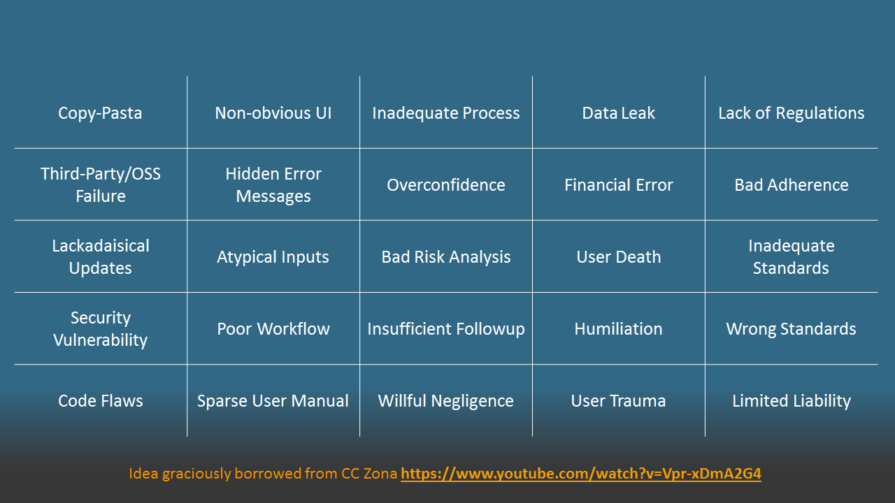
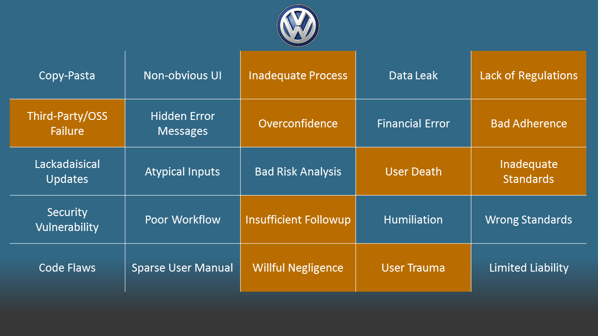
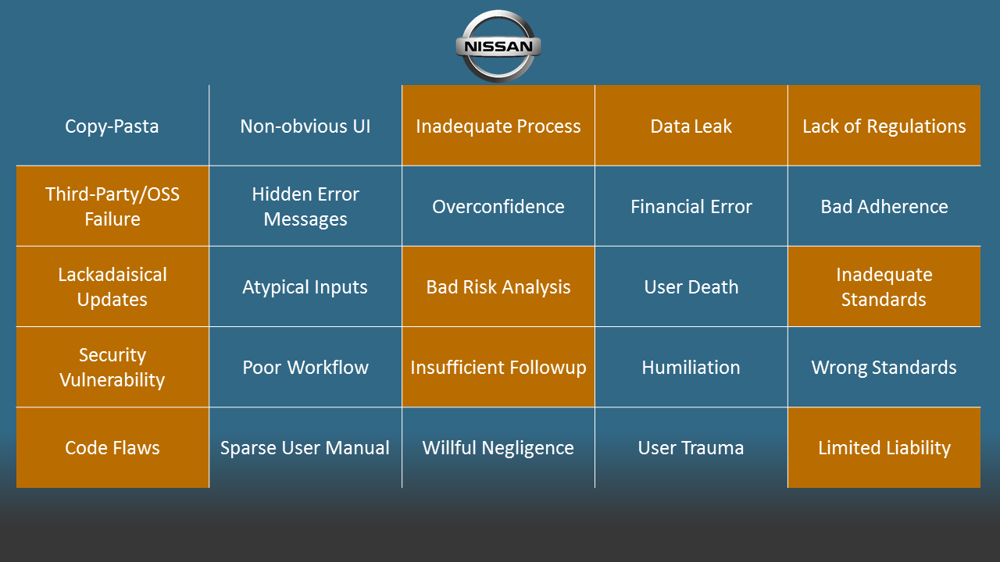

_This is a companion post for my talk of the same title given on April 22, 2016 at [IoT Fuse](https://iotfuse.com/conference-2016/) in Minneapolis, MN. Content warning: this post discusses some issues with illness and death, including mental illness; sexual assault; and contains an image of raw meat._

# Quality in the Consumer IoT
## IoT Fuse 2016

The Internet of Things represents a massive technology shift. Truthfully, much of the march towards the realization of the Internet of Things has taken place along multiple gradually-incrementing threads. But we are finally at a place where technology and expertise exists to begin weaving these threads together into a bigger tapestry. And, like many historical technological shifts, when these threads reach their confluence, the impact becomes bigger than the sum of the parts.

In the Consumer IoT---which I broadly define as the embedding of the internet into devices we encounter in our personal (but not necessarily professional) lives---this confluence leads to a deceptively large cultural shift. Previously, as users we could choose when to remove the internet from our space. We elected to sit down at a PC or to pick up a smartphone; when we left them behind, we left them behind. But the IoT proposes to remove this capability. The internet will now be in our cars, our refrigerators, and even in the the very walls of our homes.

IoT manufacturers don't simply want to sell you a smart device. Samsung isn't selling a smart refrigerator. They're selling you a [Family Hub](http://www.samsung.com/us/explore/family-hub-refrigerator/). Nissan isn't selling you an car with a smart console. They're selling you a [remote control for your vehicle](http://www.nissanusa.com/blog/carwings-app). IoT manufacturers even want to put the internet [into your toothbrush](https://www.getquip.com/).

It's worth noting that refrigerators, cars, and toothbrushes are _already_ part of our quotidian lives. We already own these devices. IoT isn't about selling a device. It's about selling software. And this is a pretty big stretch. As IoT developers, we're asking consumers to extend to us an unprecedented level of trust. We're asking them to invite our software and our algorithms into their homes and their lives.

> The consumer has no goodwill for a novel inconvenience.

This proposition bears a lot more moral weight than your traditional software engineering challenge. And to match it, we have to convince the consumer that we're making quality products. But what exactly does quality mean? Quality can mean many things to many people, but broadly speaking, I'll explore it from three perspectives. Quality is:

1. the satisfaction of consumer expectations;
2. engineering and design process;
3. the ethics of how and why we do business.

With respect to the first point, consumers expect that an IoT product _just works_. A user might get hooked on novelty, but by definition, novelty wears off---usually by the 4th interaction, if you're lucky. And with regards to the second problem, IoT devices have to be designed robustly with respect to both their canonical function (e.g. cleaning your teeth) as well as their connected function (e.g. tracking oral hygiene habits). The consumer has no goodwill for a novel inconvenience. With regards to the third definition, this calls back to some very important concepts in hard engineering fields that software engineering has largely ignored: the ethics of the engineer to not do harm. To me, these three definitions all intersect. And when failures happen, the fault tree usually includes incursions against all of these principles. Let's explore a few past and potential failure cases.

To do so, I'm going to stand on the shoulders of giants and borrow a concept directly from CC Zona's talk "Consequences of an Insightful Algorithm," which she gave as the keynote to RubyConf, among others: [https://www.youtube.com/watch?v=Vpr-xDmA2G4](https://www.youtube.com/watch?v=Vpr-xDmA2G4). This concept is "Failure Bingo," and I've adapted the concept to the IoT. The columns are roughly organized into generalized categories: software failures, usability failures, process/management failures, user harm, and "legal landscape." There's nothing particularly critical about the tiles themselves; they're just the first 5 examples that came to mind. Feel free to substitute them with your own examples, if you'd like. Incidentally, this process is more or less equivalent to performing a software Failure Mode Effects Analysis (FMEA), a risk analysis technique.

### Volkswagen Diesel Scandal

Last year, Volkswagen admitted to [using software to cheat on emissions tests.](http://blog.caranddriver.com/everything-you-need-to-know-about-the-vw-diesel-emissions-scandal/). There is a well-known link between [air pollution and deaths from heart disease](https://www.sciencedaily.com/releases/2015/09/150915094302.htm), and the increase in pollution from the Volkswagen engines could be statistically [linked to up to 60 deaths in the US](http://www.cnbc.com/2015/10/29/vw-excess-emissions-linked-to-60-us-deaths-study.html). What does this have to do with IoT? Look at how Car and Driver phrases it:

!!! Volkswagen installed emissions software... that allows them to sense the unique parameters of an emissions drive cycle.

This isn't just in the same ballpark as IoT software; it's sitting in the same dugout. To save time and space, I won't elaborate on all of the failures; suffice it to say, the failure bingo is quite comprehensive. Let's move on.

### Nissan Leaf

Sticking with the automotive theme, and moving closer into IoT space, Nissan has [recently disabled its Nissan ConnectEV app](http://www.wired.co.uk/news/archive/2016-02/24/nissan-car-hacked). This happened after a hack of the Leaf [went public](https://www.troyhunt.com/controlling-vehicle-features-of-nissan/). In short, the app used a rough variant of a RESTful API to communicate with the associated vehicle. Commands to turn on the air conditioning, for instance, could be executed by basically visiting a web page. There are two notable failures in this case: first, the API used an unauthenticated `GET` to change the behavior of the vehicle; second, the company didn't respond to the discoverer's numerous good faith messages to fix the app before going public. Even more striking is that the hack could affect _any_ Nissan Leaf. All one needs is the VIN---a **serial identifier**.

Obviously, this could be used to cause deliberate harm: a hacker could run the battery down on someone's car, preventing them from getting to work or to the hospital, for instance. But this is more than a security woe. Just throwing a bunch of encryption at this problem won't make it go away. This is a maintainability flaw. If the API is that fragile, how can we guarantee that we won't induce wild failures 10 years from now when the app is updated to support iOS 12? What if that app happens _over the air while driving?_ Part of the answer, is well-established quality engineering practices. Another part of the answer is to regulate connected software with access to vehicle features.

### Samsung Family Hub

Now let's look forward. Samsung is releasing the Family Hub refrigerator. This device is novel: it has a touchscreen built into the door. This device can show family photos, manage calendars and shopping lists, and track fridge inventory. To accomplish the latter task, the device takes photos of the inside of the fridge every time the door shuts so you can track its contents. This is a great idea with some far-reaching consequences.

Imagine you or a loved one currently has or has recovered from an eating disorder. Imagine the harm that the endless photostream of food can cause to that person. What about users who need to refrigerate medicine? That's extremely private medical information. Of course, Samsung is not a covered entity, so HIPAA privacy regulations don't apply. But the data are just as sensitive as what your provider or insurance carrier holds. Is Samsung treating those data with due regard?

### Microsoft Band

<blockquote class="twitter-tweet" data-lang="en">
Yes, this chicken breast appears to be performing some vigorous exercise... <a href="https://t.co/fY1cPSlCLM">pic.twitter.com/fY1cPSlCLM</a> via <a href="https://twitter.com/EmilyGorcenski">@EmilyGorcenski</a>
&mdash; Internet of Shit (@internetofshit) <a href="https://twitter.com/internetofshit/status/692004889380179968">January 26, 2016</a></blockquote>

I made the video above. In it, I used the photoplethysmography sensor on a Microsoft Band to read an active 120 bpm heart rate from a raw chicken breast. This is a fun bit of trivium with a bit of a dark side.

We have readily integrated fitness trackers into our lives, [despite their inaccuracies](http://vitals.lifehacker.com/these-infographics-show-the-problems-with-calorie-count-1771540530?utm_source=recirculation&utm_medium=recirculation&utm_campaign=thursdayPM). But we have maybe given into too much reliance on their data. Last year, a woman's rape claim was dismissed because her activity tracker did not corroborate her accusations. She was charged with [a crime and put on probation](http://www.nbcphiladelphia.com/news/tech/Fitbit-Fitness-Tracker-Proves-Woman-Lied-Sexual-Assault-376201701.html). The attorney general said the tracker data "sealed the deal."

**A woman's rape claim was dismissed and she was charged with a crime based on tracker data, but I can pull 120 bpm off a piece of raw chicken.** We must be careful with the amount of deference we give to these devices. There are no regulations and no standards to control the effectiveness and accuracy of these devices. There is no quality assurance that is not self-imposed by the manufacturer.

### Guaranteeing Quality

The opportunity for harm is great, so as developers and manufacturers, we have to take it seriously. There is one space in which there is ample predicate for how to manage quality development of software and hardware: the medical device industry is heavily regulated. Medical device development, deployment, support, product labeling, marketing, and data transmission is all regulated under various US federal laws; Canada and Europe have equivalent regulations. Medical device software regulation was born out of a high-profile failure: [THERAC-25](https://en.wikipedia.org/wiki/Therac-25). Medical device manufacturers and software engineers have to perform extensive risk analyses based on the risk profile of the device itself.

This is interesting to note, because medical devices are one of the most clear confluences of both consumer demand and developer innovation. People who rely on medical devices in their everyday lives are clamoring to have better integration with modern society. There is a clear use case in this field, not to mention a lot of money---at least [one estimate](http://www.mordorintelligence.com/industry-reports/global-wearable-medical-device-market-industry) projects the _wearable_ medical device market, a small subset of IoT consumer medical devices, at $7.8 billion annually by 2020. IoT makers needs to be unafraid of the regulatory environment surrounding this space.

That is not to say that the regulatory marketplace isn't burdensome. In one example, a Kickstarter project for the [myBivy app](https://www.kickstarter.com/projects/1305386921/mybivy) has raised almost $27,000 to create an app to treat PTSD-induced night terrors, a common ailment in combat veterans. However, this device claims a medical intervention, hence it qualifies as a regulated medical device, and also proposes to transmit data to providers, meaning it also falls under HIPAA. Sadly, $27,000 is about one-fifth of the cost of just getting that regulatory process in-place. It doesn't matter how great the myBivy algorithms are. They have to surivive a regulatory landscape that induces heavy up-front costs.

### Tech cannot guarantee the success of tech

All the best algorithms in the world, all the best practices and best integrations and best services are insufficient to guarantee success. Consumers demand quality even when they don't realize it. Consumers expect safety. Consumers expect to not be shamed by their refrigerator. Consumers expect their thermostats to always work. Innovation and novelty are not good enough. We need to design products with an understanding of what quality means to all stakeholders.

Quality is not an individual effort. All IoT developers are in a sink-or-swim environment and we need to work together. One high-profile IoT failure can doom many unrelated projects. It is possible to collaborate in IoT space. It is possible to take distinct actions to ensure product quality. Among them:

 - Hire diverse candidates and _give them agency_. Let them say no to a feature. Empower them to explore alternatives. Let their world experience become the channel through which you communicate to trust to people like them
 - Contribute to open source and open science. Data are not the only valuable resources for an IoT maker. If you use open-source software, allow and encourage your employees to contribute to its development during work hours. It will help make that software more robust in the future and establish your brand's commitment to quality.
 - Value soft skills. Documentation is critically important. So is customer interaction, usability, support, and all of the other things that we forget about when we classically evaluate a developer. Code will not move us forward. Changing culture is the only guarantor of IoT success. We must be culturally saavy.

That's all for tonight. There is a lot to parse here and not enough time or space to discuss it all. As always, feel free to reach out to me on [Twitter](https://twitter.com/EmilyGorcenski) if you want to discuss ways to design quality IoT products.
