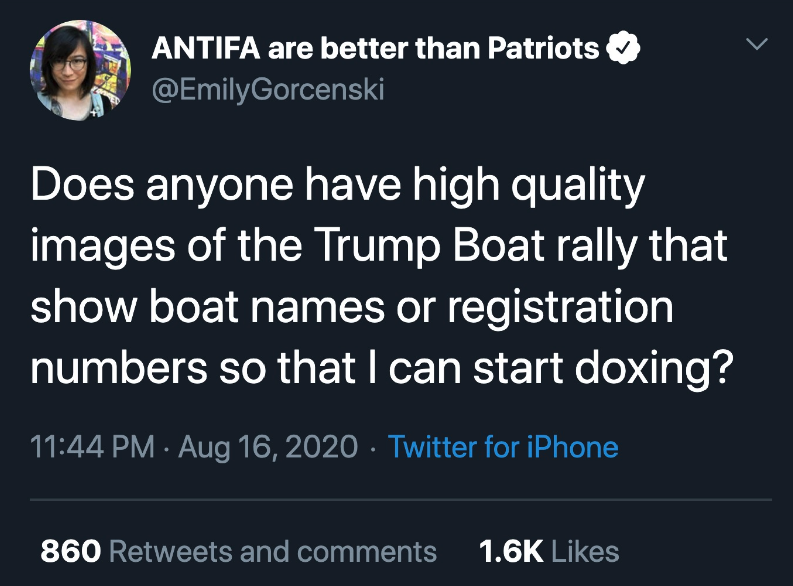
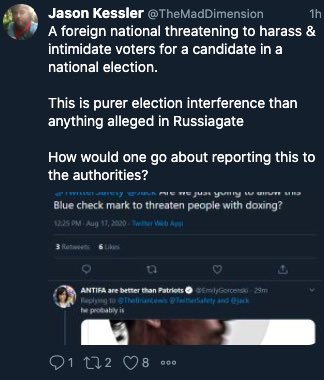

The right wing loves calling its political opponents "snowflakes" who are opposed to "facts." But let's look how they really reacted to a troll job.

<!--more-->

Ben Shapiro loves to claim, "facts don't care about your feelings." It's a smugness rooted in a superiority complex that he uses to construct a rhetorical framework in which he cannot be proven wrong, simply by defining his perceptions to be "facts" and others' perceptions to be "feelings." Like most modern conservative logic, it doesn't even maintain self consistency.

Recently, I decided to prank the American right. It started, like always, with a tweet:

This was designed to get the attention of the American right, who during their parade, actually [sunk an innocent bystander's boat](https://www.youtube.com/watch?v=CjZ2Xex2PnI), nearly killing the family. Predictably, right wing media began to lose their minds. It was precisely in this temper-tantrum that one can see precisely how feelings-oriented and sensitive they are. Within the next 24 hours, they threw every accusation in the book at me.

They called me a [terrorist](https://twitter.com/bethegreenone/status/1295711998144131074?s=20), while at the same time insisting that [they weren't scared](https://twitter.com/mattmaj89000414/status/1295598763894083587?s=20). They called me [ugly](https://twitter.com/al47200484/status/1295761138261479424?s=20). They called me a [man](https://twitter.com/oppressall/status/1295718744031928320?s=20). They called me a [whore](https://twitter.com/FreedomReigns9/status/1295519397818376192?s=20) while simultaneously insisting I couldn't get [laid](https://twitter.com/AzulikRoberto/status/1295557483591860230?s=20).

But those were just the insults. It's when they decided to really double-down on playing the victim card that things really got interesting. They insisted that [doxing is illegal](https://twitter.com/StymieSays/status/1295492879746359296?s=20) while linking to [a page](https://blogs.findlaw.com/blotter/2018/01/is-doxing-illegal.html) that says quite explicitly that it is not. They called out to the [FBI](https://twitter.com/realitybiasnews/status/1295766403459551236?s=20) and the CIA. They cried to [Jack](https://twitter.com/coldc_offee/status/1295652544753131521?s=20), the CEO of Twitter. When they found out that Jack follows me on Twitter, they cried that Twitter is [biased against conservatives](https://twitter.com/OverGrownSauce/status/1295718471716581376?s=20).

When that wasn't enough, and despite "doxing" apparently being the worst thing in the world, they decided to try to dox me instead, posting several addresses I haven't lived at in over a decade—and which were on the wrong continent. While they were screaming to the FBI that my "doxing" was endangering their families, they were emailing me threatening my former family. Jason Kessler, whose short-lived organization [actually doxed me](https://www.washingtonpost.com/local/public-safety/organizer-of-unite-the-right-rally-in-charlottesville-arrested-again/2017/10/17/ae98ee24-b372-11e7-add3-da4b781e34b1_story.html), claimed that I was a "foreign national" somehow commiting "election interference."

They reported me multiple times to Twitter—none of them succeeded, because despite their desperate cries for victimhood, my tweet wasn't against the rules, the law of any nation, or even basic morality. Despite this, Andy Ngo, who has knowingly and maliciously lied about me in the past, [called me "extreme"](https://twitter.com/MrAndyNgo/status/1295641607383863296?s=20) and repeated the lie that the deceased Dayton shooter was a follower of mine.

Their behavior reflects of the right-wing mentality of ["Schrödinger's Leftist"](https://www.urbandictionary.com/define.php?term=Schr%C3%B6dinger%27s%20leftist): an left-winger so sensitive and fragile that they need safe spaces and coddling, but who are simultaneously terroristic threats to the very existence of freedom itself. It betrays a raw sensitivity, a fragility over the concept that their very public actions could possibly receive any unfavorable scrutiny. If there is a threat, it's the threat of receiving negative feedback and having to face the fact that their behaviors—ranging from defending neo-Nazi terrorists to promoting conspiracy theories about a deadly pandemic—are simply eminently unlikeable.

This is all very interesting except there's one missing detail:

_I never actually doxed anyone._

Not only did I not publish anyone's name, address, contact information, or any other such details. I posted one cropped image of a boat, a publicly available image taken from a news site where nobody was visible.

In other words, the entire outrage campaign, from the QAnons to the Patriots, from neo-Nazi rally organizer Jason Kessler to neo-fascist riot planning observer Andy Ngo, was crafted based on pure id, a base fear unfounded by any material reality, purified rage and terror based on lies and deeply-rooted anxieties. The entire outrage campaign wasn't based on facts. It was based entirely on feelings. Hundreds of "patriots" went crying to the FBI, the police, the CIA, the Germany embassy, my employer, and even my mom—despite me not actually doing anything. The party that cries so much about "free speech" instead showed their repressive mentalities by throwing an epic national tantrum around a single solitary question, one which was never backed—and was never going to be backed—by action.

Regardless of how the American presidential election turns out, the right knows that they are losing the moral battle. Their backlash reveals a discomfort in their souls. They know they've gone too far, and there's nowhere else to dig but down. They are the side of [terrorism](https://www.forbes.com/sites/carlieporterfield/2020/06/25/white-supremacist-terrorism-on-the-rise-and-spreading/) and [white supremacist murder](https://www.adl.org/murder-and-extremism-2019). They are the side of [plague](https://www.nbcnews.com/think/opinion/covid-19-conspiracies-get-embraced-trump-right-wing-media-because-ncna1235238) and [fake news](https://www.theguardian.com/technology/2018/feb/06/sharing-fake-news-us-rightwing-study-trump-university-of-oxford). So they try to cleanse their conscience through an invented narrative of victimhood, creating demons where there are none.

The facts, however, will never care about their feelings.
