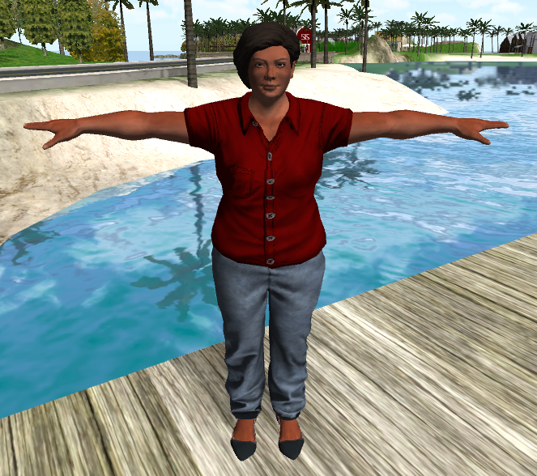

_This post accompanies my talk given at [AlterConf DC](http://www.alterconf.com/sessions/washington-dc) on 30 January 2016. A video of the talk with visible slides can be seen [here](http://confreaks.tv/videos/alterconfwashington2016-social-and-design-factors-in-video-games-for-therapy-and-rehabilitation)._

# Social and Design Factors in Video Games for Therapy and Rehabilitation
## AlterConf DC 2016

Over the past few years, there has been a growing trend of trying to leverage video games as medical interventions in rehabilitation spaces. This trend has taken many names--gamification, serious games, etc.--but these names also apply to applications and concepts beyond the medical field. We'll simply use the term _Video Game Therapy_ to mean video games used and/or designed explicitly for self-improvement in the light of some medically-recognized condition. The applications are still broad. Therapy games can be used for addiction recovery, physical and occupational therapy, mental health management, and much much more. In this post I want to talk a bit about my work in this space. The post will be largely introductory, but I want to talk about some specific social factors that can dramatically affect the success of a therapy game that aren't immediately apparent.

## Identity in Gaming

Using video games for healing is a very personal topic for me. During my senior year of college oh those many years ago, I was diagnosed with a pretty serious endocrine disorder. This disorder adversely affected both my physical and mental health: my resting heart rate was 140 bpm; my personality was awful; I couldn't sleep, couldn't focus. Eventually, with one semester until graduation, I was forced to take a medical leave of absence.

The impact of leaving school was dramatic for me. All of my social structure was built around my university. All my friends were there. All my dreams hinged upon going to grad school. I had a strong identity as a student and as an academic. The summer before my diagnosis, I had a prestigious research fellowship studying fusion energy at Princeton. And I was beginning to understand my sexuality, if not my gender. That year, I had started coming out to close friends as bisexual. When I got sick, all of that changed.

Recovery was not easy, both mentally and physically. I resisted medical treatment--I just wanted to go back to school. I wanted everything to be normal again. Everything that I had that I was good at was gone. Eventually, I stabilized medically enough to take several jobs, first at a driving range, then as a substitute teacher, then as a part-time clerk at a bookstore. This was a pretty far cry from doing nuclear physics at Princeton. I was lost, lonely, broke, and despondent. Worse still, I had no identity.

Eventually, I found a video game. I took to it like a fish to water. It gave me something to do. Each level was a goal. The virtual world was an escape from the real one. I had friends who played, and we suddenly had something to talk about while we tossed boxes of books around. Eventually, my health started turning around. And the more I played, the healthier I felt. And the healthier I felt, the better I became at the game. This video game gave me an identity again. And eventually, I got healthy enough, and had saved enough money, to return to finish my degree. And I got better at the game. And then I graduated, and I got better at the game. And then I got a job, and I got better at the game. And eventually, I became one of the top players in the world. I met a partner through the game. Things were pretty good.

But something else happened along the way. Eventually, I stopped needing the game, because most of the things I had lost had come back. I was a student again, and then an engineer; I was a partner to a lovely person. But in this tireless peak to be as good at the game as possible, I found that I had to make a choice: be good, or be myself.

Being good meant being healthy. But once I was healthy, what was "being good" even worth? The game was suppressing a huge part of who I was: I was bisexual and I was transgender, and I couldn't share either of those things within the in-game community. It was simply too hostile. The game culture didn't support people like me. I needed to be out. I needed to be myself. But I couldn't do that if I kept playing. So I quit. And ten years after I first started to come out, I came out as bisexual again. And a couple years later, I would finally come out as trans.

Video games have this immense power to shape our self-image of who we are. Identity and gaming is inseparable. But so is identity and trauma. So my core question is: how can we use the power of video games to resore the identities of those who have suffered trauma?

## Why Video Games for Therapy

The logic behind early efforts in making therapy games goes something like this: "games are fun, therapy is boring. If therapy is a game, then therapy is fun." Ask any therapist: adherence is the biggest obstacle to success. So games seem like an attractive solution. People get lost in games, farming achievements, doing daily quests, trying for a new high score. Games offer the kind of motivational appeal that therapists can only dream of. But, after many years of trying, therapy games haven't exactly been setting the world aflame. Why is this?

Let's explore the core assumption here.

> Video games are fun.

Are they? I posit not.

Video games are infuriating. They're annoying and frustrating. They're compelling and emotional. They make us laugh, they make us cry. They make us throw our headsets across the room. They keep us up at night. They connect us to people around the world. They do all these things that aren't just _fun_. Fun is what happens when the other things go on. Fun is what happens when our experiences transcend our quotidian reality. Games aren't fun. Games are powerful.

## Self-Determination Theory

As it turns out, there is a psychological model that posits that motivation comes from the satisfaction of three basic psychological needs: Competence, Autonomy, and Relatedness. This is the core premise of _[Glued to Games](http://www.amazon.com/Glued-Games-Video-Spellbound-Directions/dp/0313362246)_. (Disclosure: Scott Rigby, the author, was a paid consultant on a project for which I was Principal Investigator). As it turns out, some of the most popular commercial games can be shown to satisfy these psychological needs.

When I learned about this theory, a lightbulb went off in my head. I instantly understood exactly why I sunk so much time into a video game while I was healing. I needed competence: before I got sick, I had school. Afterwards, nothing. I needed autonomy: before I got sick, I had goals and a dream. Afterwards, I lived with my parents again. I needed relatedness: before I got sick, I had friends and companions. Afterwards, I had nobody. The game gave me all of that.

Relatedness is a very powerful idea. Using relatedness, we can tell a user that they belong. We can console them. We can empathize with their trauma. We can journey with them through their recovery. If we can design for relatedness, we might be able to make therapy games successful.

## Therapy Gaming

So what does one do in a therapy game? In occupational therapy, the goal is often to restore the patient to enough functionality that they can perform Activities of Daily Living (ADLs) such as grooming, eating, and going to the bathroom. This doesn't virtualize well -- it's too uncanny. Alternatively, the next level of self-care is considered the Instrumental Activity of Daily Living: shopping, preparing food, doing housework, tracking finances. These are easier to virtualize. But they're not really fun. You can only turn "doing laundry" into a game for so long before it gets boring again.

In one of our prototypes, we designed an activity for putting away groceries and an activity for preparing breakfast. Clinically, these activities were interesting. But to many of the users, they weren't very good at all. They were, at first, perhaps novel, but novelty only covers sins for so long.

## Identity and Relatedness

As it turns out, the game we developed was designed for stroke victims, many of whom tend to be elderly. And some of the elderly men found these tasks to be somewhat insulting. To them, shopping, dealing with groceries, and cooking were all highly-gendered tasks that belonged to women. And so what happened was we failed our relatedness test: rather than communicating to the user that the virtual world was one in which they belonged, we instead piled onto their trauma. Their identity had already been compromised by their stroke. And now here we were telling them to do "women's work." And although that opinion is far from progressive, the objective of treatment is to provide care. Instead, we were risking harm.

So in the subsequent version of the software, we explored other ways to communicate relatedness in a game. We came up with several ways to do this:

* Provide avatars and character models that match the person's self-image;
* Provide tasks that empower the user;
* Provide choice in what the user can do.

We made sure to include avatars of several skin tones, several body sizes, and several genders. We don't expect all of these users to select these avatars. We don't even expect the user to select the avatar that best matches their real-life persona. But by showing them multiple options, we relate to the user and send a message that they belong.

We made sure to design tasks that empowered the user. One of the biggest factors cited by patients in choosing to undergo therapy is that they don't want to have their pets taken away. We added a puppy to the game for the user to care for. And in fact, we added six puppies to choose from, and the user was able to adopt their favorite. Not only does this give the user an NPC with which to bond, it also empowers their sense of competence by requiring them to care for the animal. This tells the user that we believe in their capabilities.

Further, we allowed the user to skip activities. Even the puppy dog is a controversial choice: a Muslim user, for instance, may have a cultural resistance to caring for a dog. So we let the user skip those activities if they feel uncomfortable.

Ultimately, this design experience leads to the key points for Relatedness design:

1. Relate to your user;
2. Don't ever make your user relate to you.

Unfortunately, many game developers find option 2 to be easier. And perhaps this is why Video Game Therapy has not yet had its breakout success.

## Final Remarks

Games have a remarkable power to modulate identity, so cultural and social issues are not supplemental to the design of a game; they are **central** to it. By considering the user's needs, it is possible to make therapy fun. It is possible to give users challenges that they can identify with. It is possible to empower the user through simple gameplay. Games _can_ be used for healing, but we have to recognize what exactly it is that games do to make people healthy.

And more importantly, it's also important to remember that therapy games are medical devices, and that when we design them we must keep in mind the core ethic of the medical profession: **do no harm.** It's doesn't have to be perfect. It's not necessary to design for every user's unique cultural experience. But it is necessary to have these discussions during the design phase, and to take ownership of the features that you put in or leave out. The games are about people. It's important not to forget that.
